<p align="center">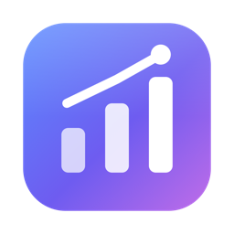</p>

# MetaDash

[🇹🇷 Türkçe](README.tr.md)

Local-first desktop analytics for Instagram accounts and Meta Ads, built for teams that manage many accounts at once.

MetaDash pulls organic Instagram data (Graph API) and Meta Ads data for every account you manage, stores it in a local SQLite database, and turns it into portfolio overviews, per-account analytics, comparisons, competitor tracking, budget pacing, client-ready reports (HTML, PDF, Excel) and in-app presentations. There is no server and nothing to sign up for: the app talks directly to the Meta Graph API using your own Meta app and access token.

- **Platforms:** macOS (Apple Silicon and Intel), Windows, Linux
- **Stack:** Electron 33, React 18, Vite, TypeScript, Tailwind CSS, better-sqlite3
- **License:** [MIT](LICENSE)

## Contents

- [Screenshots](#screenshots)
- [Features](#features)
- [Download and install](#download-and-install)
- [Quick start](#quick-start)
- [Language](#language)
- [Data and privacy](#data-and-privacy)
- [Development](#development)
- [Project structure](#project-structure)
- [Architecture](#architecture)
- [Contributing](#contributing)
- [License](#license)

## Screenshots

All screenshots use the built-in [demo data](#demo-data) — the accounts and posts are fictional.

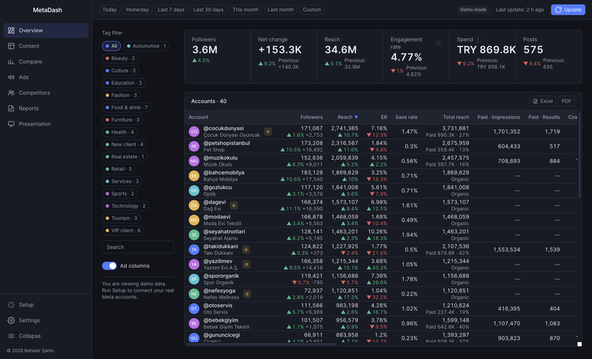

<table>
  <tr>
    <td width="50%">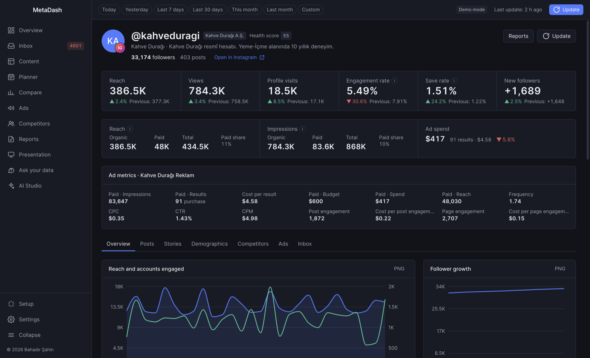<br><sub>Account detail</sub></td>
    <td width="50%">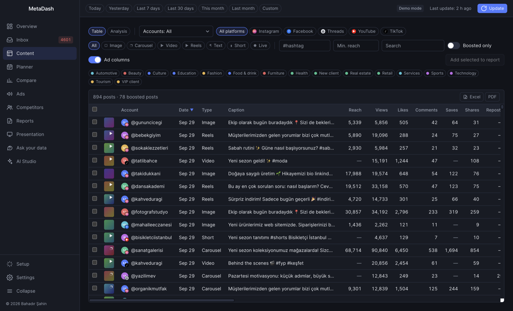<br><sub>Content — all posts, filterable, with ad metrics</sub></td>
  </tr>
  <tr>
    <td width="50%">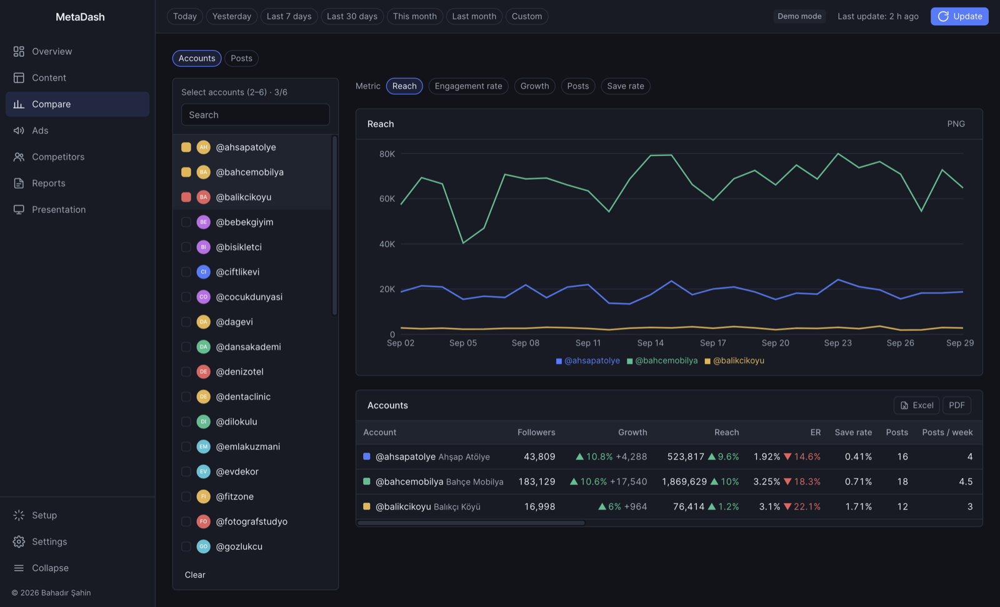<br><sub>Compare accounts</sub></td>
    <td width="50%">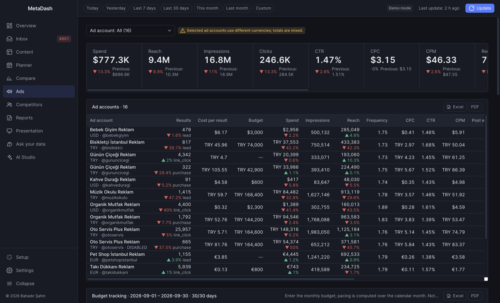<br><sub>Ads — ad accounts and budget tracking</sub></td>
  </tr>
  <tr>
    <td width="50%">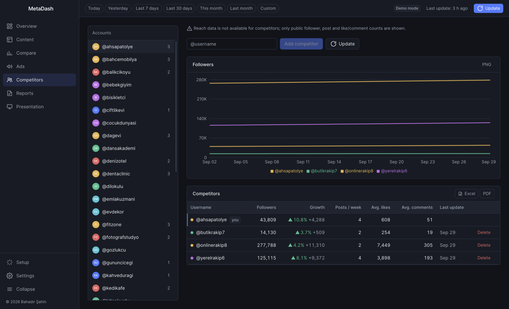<br><sub>Competitors</sub></td>
    <td width="50%">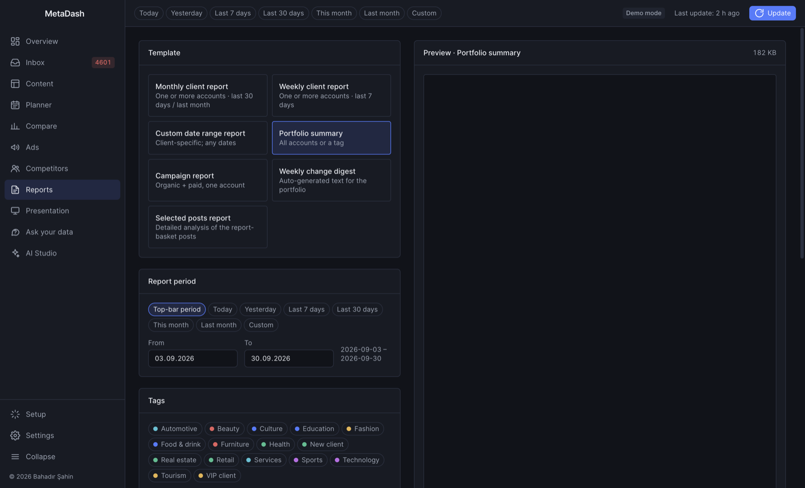<br><sub>Reports — live preview, HTML/PDF/Excel export</sub></td>
  </tr>
  <tr>
    <td width="50%">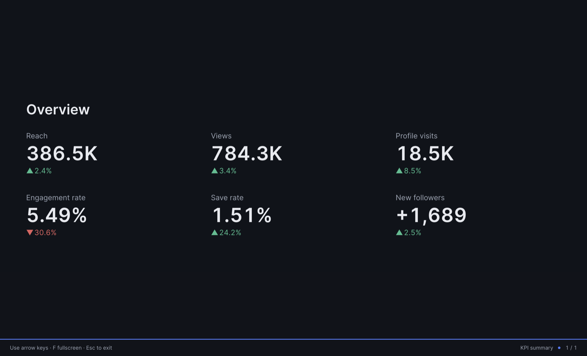<br><sub>Presentation mode</sub></td>
    <td width="50%">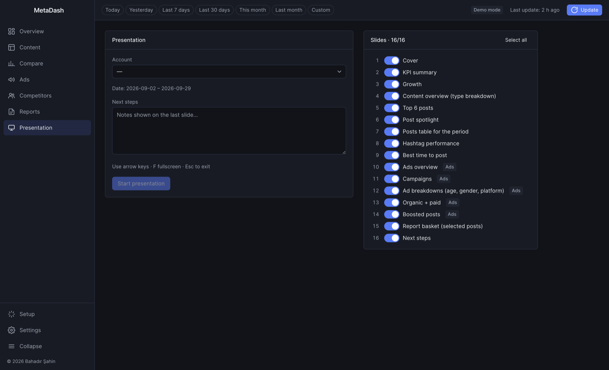<br><sub>Presentation builder</sub></td>
  </tr>
  <tr>
    <td width="50%">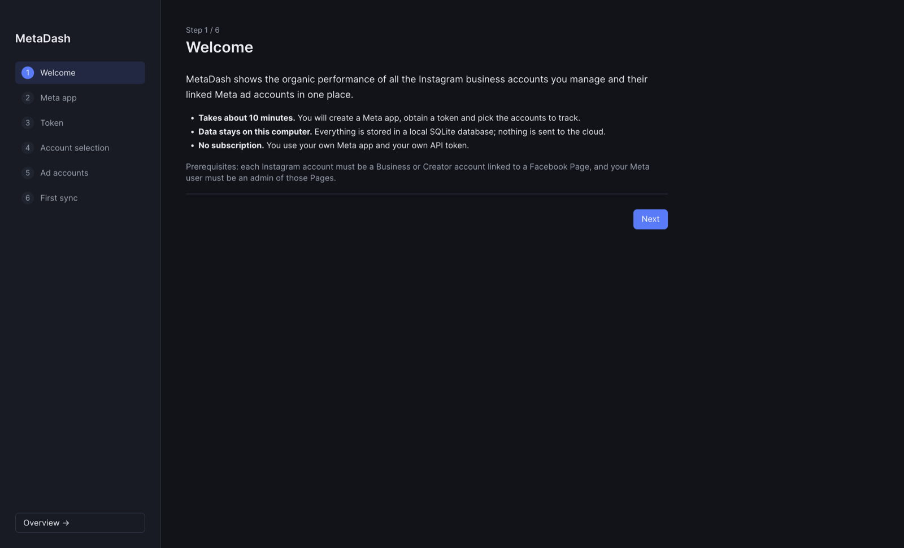<br><sub>Setup wizard</sub></td>
    <td width="50%">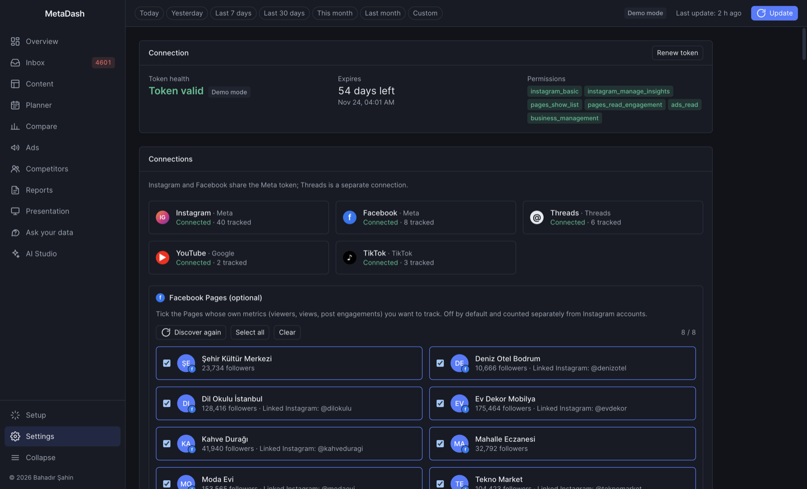<br><sub>Settings</sub></td>
  </tr>
</table>

## Features

| Area | What you get |
| --- | --- |
| **Overview** | Portfolio table of every tracked account: followers and net change, reach, engagement rate, save rate, post count, health score, organic vs. paid reach and ad spend. Search, tag filter and leaderboard. |
| **Account detail** | Follower and reach/engagement charts, KPIs vs. the previous period, health score breakdown, post grid and table, stories (completion and exit rate), audience demographics (city, country, age and gender), best-time-to-post heatmap, post lifecycle curves ("80% of engagement within the first N hours"), linked ad account metrics and an organic + paid view. |
| **Content** | Cross-account post table with filters (type, minimum reach, boosted only, search) and optional ad metric columns; content analysis (type breakdown, hashtag performance, top posts); a report basket for hand-picked posts. Each post opens a drawer with its lifecycle, ad rows and notes. |
| **Compare** | Side-by-side comparison of selected accounts, and post-to-post comparison. |
| **Ads** | Ad account table with one consistent metric set (impressions, results and cost per result, budget, spend, reach, frequency, CPC, CTR, CPM, post/page engagement and their costs). Campaign, ad set and ad levels; age, gender and platform breakdowns; organic + paid blend; ads linked back to the Instagram posts they promote. |
| **Budget tracking** | Monthly budget per ad account with calendar-month pacing, remaining budget, required daily spend, today / yesterday / last 7 days, month-end forecast, and "boost candidates" (recent un-boosted posts) for accounts under pace. A budget allocation tree splits budgets across campaign → ad set → ad, with manual overrides. MetaDash never writes anything back to Meta. |
| **Competitors** | Track public competitor accounts via Business Discovery: followers, growth, posting frequency, average likes and comments (reach is not available for competitors). |
| **Reports** | Templates: monthly client report, weekly client report, custom date range, portfolio summary, campaign report (organic + paid), weekly change digest, selected-posts report. Choose sections, add a logo and commentary, pick the report language, save presets. Export as self-contained HTML (charts embedded as SVG, works offline), PDF, or multi-sheet Excel. |
| **Presentation** | Full-screen slide deck generated from your data (cover, KPIs, growth, content, top posts, spotlight, hashtags, best time, ads, campaigns, breakdowns, boosted posts, report basket, next steps). Arrow keys to navigate, `F` for full screen, `Esc` to exit. |
| **Exports everywhere** | Every data table can be saved as `.xlsx` or landscape A4 PDF, every chart as PNG. |
| **Notifications** | Optional desktop notifications after each sync and once a day: unusual changes in the last 2 days, ad accounts at 90% of their monthly budget, accounts silent for 7+ days, and a Meta token that expires within 7 days. Each type can be turned off in Settings; clicking a notification opens the matching screen. |
| **Updates** | Packaged builds check GitHub Releases for new versions. Windows and Linux AppImage download and install in-app (restart to install); macOS and `.deb` builds link to the release page. Can be turned off in Settings. |
| **Sync** | Incremental sync with per-type queues, automatic slow-down when Meta's usage headers climb, tiered refresh of post insights by post age, stories refreshed on an interval, optional daily auto-sync while the app is open. |
| **Settings and data** | Account management (client name, color, tags, tracking), ad account linking, token health and renewal, sync history and errors, unsupported-metric management, database backup and restore, full data transfer between computers (`.metadash` files), CSV export, read-only SQL console, dark/light theme, English/Turkish UI. |

## Download and install

Download the latest installer from **[GitHub Releases](https://github.com/mbahadirs/metadash/releases)**.

| Platform | File |
| --- | --- |
| macOS, Apple Silicon | `MetaDash-<version>-mac-arm64.dmg` |
| macOS, Intel | `MetaDash-<version>-mac-x64.dmg` |
| Windows x64 | `MetaDash-Setup-<version>.exe` (installer; you can choose the install directory) |
| Linux x64 | `MetaDash-<version>-linux-x86_64.AppImage` or `MetaDash-<version>-linux-amd64.deb` |

### Unsigned builds

Release builds are only code-signed when signing secrets are configured for the repository, so your operating system may warn you on first launch.

- **macOS** ("MetaDash cannot be verified" or "is damaged"): move the app to Applications, then either run

  ```bash
  xattr -cr /Applications/MetaDash.app
  ```

  or try to open it once, go to **System Settings → Privacy & Security** and click **Open Anyway**.
- **Windows** (SmartScreen "Windows protected your PC"): click **More info → Run anyway**.
- **Linux:** make the AppImage executable (`chmod +x MetaDash-*.AppImage`) and run it, or install the Debian package with `sudo apt install ./MetaDash-*.deb`.

## Quick start

1. **Create a Meta app** in Development mode and add the required permissions. The full walkthrough, including Graph API Explorer and troubleshooting, is in **[docs/meta-app-setup.md](docs/meta-app-setup.md)**. The Setup wizard's "open guide" button opens the same document.
2. **Run the Setup wizard** in MetaDash:
   1. **Welcome**
   2. **Meta app** – paste the App ID and App Secret.
   3. **Token** – paste a user token from Graph API Explorer. MetaDash exchanges it for a 60-day long-lived token and shows which permissions were granted.
   4. **Account selection** – pick the Instagram accounts to track; set client names and tags.
   5. **Ad accounts** – optionally link each ad account to an Instagram account.
   6. **First sync**
3. Click **Update** in the top bar to refresh data, or enable daily auto-sync in **Settings**.

Permissions: `instagram_basic`, `instagram_manage_insights`, `pages_show_list`, `pages_read_engagement`, `ads_read` (required); `business_management` (needed when Pages or ad accounts live in a Business Manager) and `instagram_manage_comments` (comments module) are optional.

## Language

The UI is in **English** by default. Switch to **Türkçe** in **Settings → Theme · Language**. Reports have their own language selector, so you can produce Turkish reports from an English UI and vice versa.

## Data and privacy

- **Everything stays on your computer.** All data is kept in a single SQLite database (`data.db`, WAL mode) in the user data directory:

  | OS | Location |
  | --- | --- |
  | macOS | `~/Library/Application Support/MetaDash/` |
  | Windows | `%APPDATA%\MetaDash\` |
  | Linux | `$XDG_CONFIG_HOME/MetaDash/` (usually `~/.config/MetaDash/`) |

- **Secrets are encrypted at rest.** The Meta access token and App Secret are encrypted with AES-256-GCM using a key derived from a machine identifier (hardware UUID on macOS, `MachineGuid` on Windows, `/etc/machine-id` on Linux). A copied database cannot decrypt them on another computer. To move to a new machine, use **Settings → Data transfer**, which can carry the secrets re-encrypted with a passphrase you choose.
- **No telemetry, no analytics, no MetaDash server.** The main process makes network requests to `https://graph.facebook.com` (API calls and an online check). Profile pictures and post thumbnails are displayed from the Meta CDN URLs returned by the API.
- **Update checks (packaged builds only).** Installed builds check GitHub for a newer release shortly after start and every 6 hours: macOS and `.deb` builds query `https://api.github.com` (latest release); Windows and Linux AppImage builds read the release metadata (`latest*.yml`) from `https://github.com` release downloads and fetch the installer only when you click **Download**. Nothing about you or your data is sent. Turn it off in **Settings → About → Check for updates automatically**; development builds never check.
- **Desktop notifications** are generated locally from your own database; nothing leaves the computer.
- Links such as "Open in Instagram" open in your default browser.

## Development

### Prerequisites

- Node.js 20 or newer, npm
- A C/C++ toolchain in case `better-sqlite3` has to be compiled for your Electron version (Xcode Command Line Tools on macOS, Visual Studio Build Tools on Windows, `build-essential` and `python3` on Linux)

### Setup

```bash
git clone https://github.com/mbahadirs/metadash.git
cd metadash
npm install        # postinstall rebuilds better-sqlite3 for Electron
npm run dev        # Vite dev server + Electron with hot reload
```

`npm start` builds the renderer once and launches Electron without the dev server.

### Demo data

You do not need a Meta app to work on the UI. Development builds can generate a deterministic demo dataset: 40 accounts over 120 days with follower snapshots, daily insights, posts and lifecycle snapshots, stories, comments, demographics, 16 ad accounts (campaigns, ad sets, ads and breakdowns), competitors and sync history.

```bash
npm run seed          # write demo data into the user data directory (skipped if already seeded)
npm run seed:reset    # wipe and regenerate the demo data
```

Other ways to get demo data:

- Click **Load demo data** in the Setup wizard or in Settings.
- Launch Electron with `--demo`, which seeds an empty database on startup, e.g. run `npx vite` in one terminal and `npm run dev:electron -- --demo` in another.

With demo data, **Update** does not call the Meta API; it simulates the sync phases and advances the dataset by one day. Demo data is disabled in packaged builds. To switch to real accounts, use **Settings → Delete all data** and run the Setup wizard.

### Environment variables

| Variable | Purpose |
| --- | --- |
| `METADASH_USER_DATA` | Override the user data directory (where `data.db` lives). Handy for keeping dev data separate. Also honored by `npm run seed`. |
| `VITE_DEV_SERVER_URL` | Load the renderer from a dev server instead of `dist/renderer` (set by `npm run dev`). |
| `METADASH_GRAPH_DELAY_MS` | Base delay between queued Graph API requests, in ms (default `250`). |
| `METADASH_SMOKE` | `1` runs the smoke test: visits every route, saves screenshots and exits non-zero on renderer errors (set by `npm run smoke`). |
| `METADASH_SMOKE_DIR` | Screenshot directory for the smoke test (default `<userData>/smoke`). |
| `METADASH_SMOKE_ROUTES` | Comma-separated hash routes to visit instead of the default set. |
| `METADASH_SMOKE_THEME` | `light` or `dark`, forces a theme for screenshots. |
| `METADASH_SMOKE_SYNC` | `1` also runs a sync at the end of the smoke test (use with demo data). |

### Testing

```bash
npm test            # Vitest, run under Electron's Node so the native better-sqlite3 build matches
npm run typecheck   # TypeScript check of the renderer
npm run smoke       # builds the renderer and walks every screen in a real Electron window
```

The test suite covers analytics, the database layer, Meta error handling, metric mapping, organic data parsing, and an end-to-end sync against a fake Graph API (`tests/sync.integration.test.js`: token exchange, account discovery, pagination, dropping unsupported metrics, stories, ads, ad-to-post linking, stopping on error code 190).

Seed demo data (`npm run seed`) before running the smoke test.

### Building installers

```bash
npm run build:mac     # dmg + zip, arm64 and x64
npm run build:win     # NSIS installer, x64
npm run build:linux   # AppImage + deb, x64
npm run build         # all of the above
```

Output goes to `release/`. Each build script rebuilds `better-sqlite3` for Electron afterwards so `npm run dev` keeps working. Native modules make cross-compiling unreliable; build each platform on its own OS (the release workflow does exactly that).

Optional code signing: electron-builder picks up a "Developer ID Application" certificate from the macOS keychain, or `CSC_LINK` / `CSC_KEY_PASSWORD`. For a notarized macOS build set `APPLE_ID`, `APPLE_APP_SPECIFIC_PASSWORD` and `APPLE_TEAM_ID` and run `npm run build:mac:notarized`.

### Releasing

Releases are built by GitHub Actions ([`.github/workflows/release.yml`](.github/workflows/release.yml)).

1. Update [CHANGELOG.md](CHANGELOG.md) and commit.
2. Bump the version: `npm version patch` (or `minor` / `major`). This updates `package.json`, commits, and creates a `vX.Y.Z` tag.
3. Push the commit and the tag: `git push --follow-tags`.
4. The workflow checks that the tag matches the `package.json` version, runs the tests, builds on macOS, Windows and Linux, and publishes a GitHub Release with the installers attached.

If the repository has signing secrets (`CSC_LINK`, `CSC_KEY_PASSWORD`; for notarization also `APPLE_ID`, `APPLE_APP_SPECIFIC_PASSWORD`, `APPLE_TEAM_ID`), the builds are signed; otherwise they are unsigned. The workflow can also be started manually to rebuild an existing tag.

## Project structure

```
src/
  main/                  Electron main process (ES modules)
    index.js             app lifecycle, window, smoke-test runner
    preload.cjs          contextBridge: exposes window.api to the renderer
    i18n.js              main-process user-facing messages
    ipc/                 IPC handlers grouped by domain
    meta/                Graph API client, rate limiter, errors, metric map, auth,
                         organic / stories / ads / competitor fetchers
    sync/                orchestrator (p-queue), jobs, scheduler, progress events, demo sync
    db/                  better-sqlite3 connection, numbered SQL migrations, query modules
    analytics/           derived metrics: health, engagement, best time, lifecycle, anomaly, budget, ...
    export/              HTML / PDF / Excel reports, table exports, CSV, data transfer
    config/              settings store, secret encryption, machine id
    seed/                deterministic demo data generator
  renderer/              React 18 + Vite + TypeScript + Tailwind
    routes/              Overview, Account, Content, Compare, Ads, Competitors,
                         Reports, Presentation, Settings, Setup
    components/ charts/ hooks/ store/ lib/ styles/
scripts/
  seed.js                demo data CLI
  afterPack.cjs          flips Electron fuses on packaged binaries
tests/                   Vitest suites
docs/                    Meta app setup guide and architecture (Turkish versions in docs/tr/)
resources/               build resources (macOS entitlements, setup screenshots)
electron-builder.yml     packaging configuration
```

## Architecture

The renderer has no Node.js access. It talks to the main process only through `window.api`, exposed by the preload script, and every call resolves to `{ ok: true, data }` or `{ ok: false, error: { code, message, hint } }`. The main process owns the database, the Meta token and all network access. Syncs run in the main process through per-type queues and a rate limiter driven by Meta's usage headers.

See **[docs/architecture.md](docs/architecture.md)** for details: IPC, database and migrations, sync orchestration, analytics, exports, data transfer and the security model.

## Contributing

Contributions are welcome. See [CONTRIBUTING.md](CONTRIBUTING.md) for the development workflow, commit conventions and how to add translations. To report a security issue, follow [SECURITY.md](SECURITY.md). Release notes are in [CHANGELOG.md](CHANGELOG.md).

## License

[MIT](LICENSE) © 2026 Bahadır Şahin and contributors.

MetaDash is an independent project and is not affiliated with, endorsed by or sponsored by Meta Platforms, Inc. Instagram and Facebook are trademarks of Meta Platforms, Inc.
