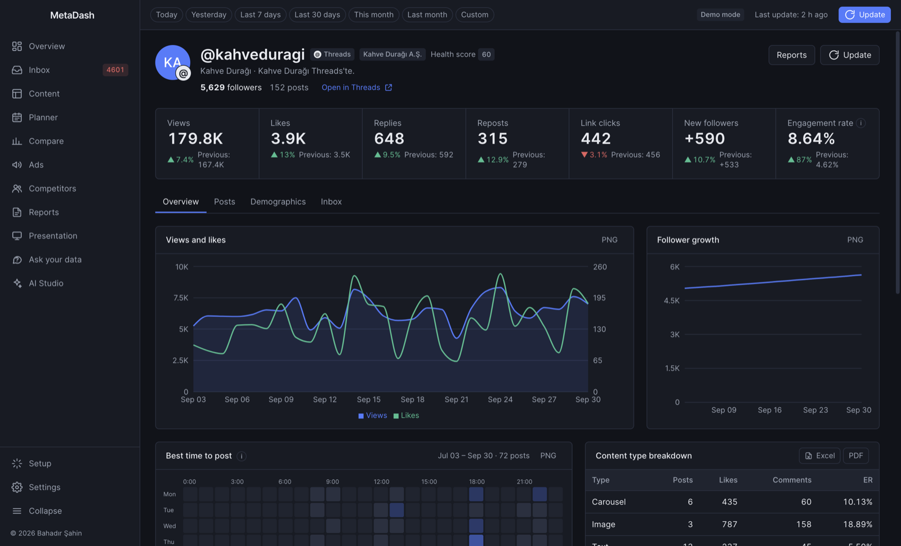
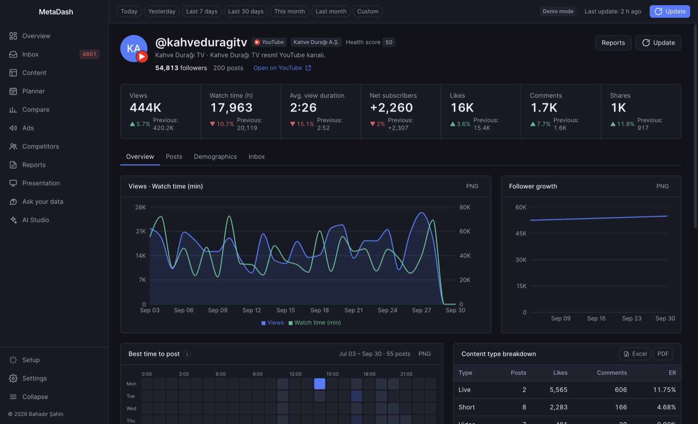
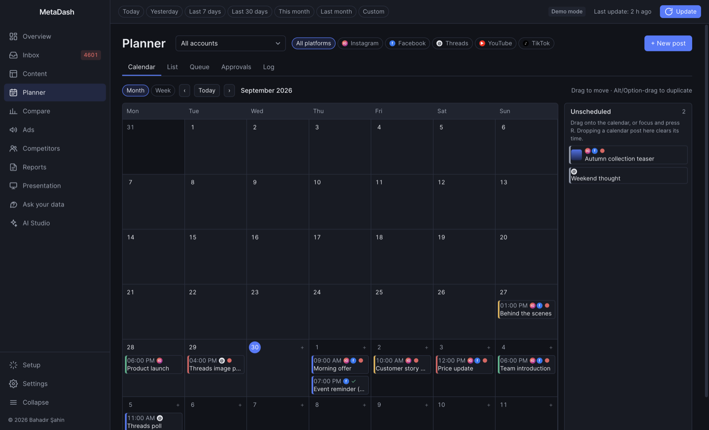
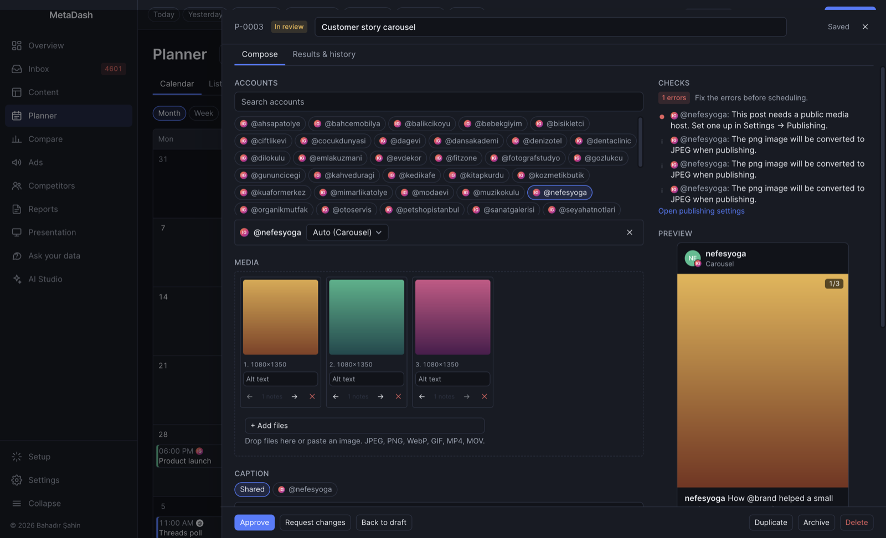
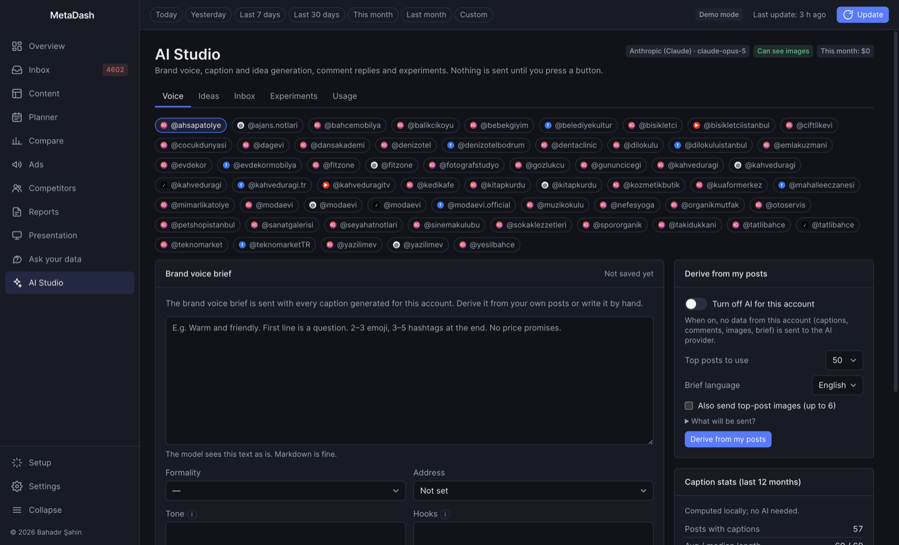
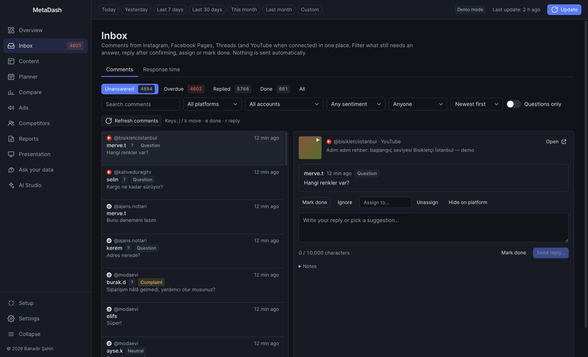
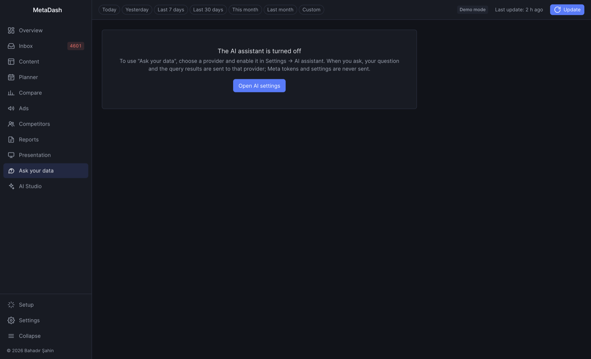

<p align="center"></p>

# MetaDash

[🇹🇷 Türkçe](README.tr.md)

**Analytics, content planning and an AI studio for Instagram, Facebook Pages, Threads, YouTube, TikTok (experimental) and Meta Ads. It runs on your desktop and keeps your data there. It is free and open source.**

MetaDash is built for agencies and teams that manage many accounts. It pulls data from the official platform APIs with your own developer apps and tokens, stores everything in a local SQLite database, and turns it into portfolio overviews, per-account analytics, client reports, a content calendar with publishing, a unified comment inbox and optional AI tools. There is no MetaDash server, nothing to sign up for and no telemetry.

- **Runs on:** macOS (Apple Silicon and Intel), Windows, Linux
- **Languages:** English and Turkish (complete); German and Spanish (partial, English fallback)
- **Stack:** Electron 33, React 18, Vite, TypeScript, Tailwind CSS, better-sqlite3
- **License:** [MIT](LICENSE)

## Contents

- [Highlights](#highlights)
- [Supported platforms](#supported-platforms)
- [Screenshots](#screenshots)
- [Features](#features)
- [Download and install](#download-and-install)
- [Quick start](#quick-start)
- [Data and privacy](#data-and-privacy)
- [Documentation](#documentation)
- [Development](#development)
- [Project structure](#project-structure)
- [Architecture](#architecture)
- [Contributing](#contributing)
- [License](#license)

## Highlights

- **One portfolio, five platforms.** Instagram, Facebook Pages, Threads, YouTube and TikTok side by side, plus Meta ad accounts with budget pacing. Metrics a platform does not have show "—", not zero.
- **Plan and publish.** A drag-and-drop calendar, a multi-account composer that checks each platform's limits, an approval workflow with offline client approval packs, and scheduled publishing to Instagram, Facebook Pages and Threads.
- **Client-ready output.** White-label HTML, PDF and Excel reports, a full-screen presentation mode, and exports from every table and chart.
- **AI when you want it.** Bring your own key for Claude, OpenAI or Gemini, or use a local Ollama model. You can ask questions about your data, draft report commentary, and use the AI Studio for brand voice, captions, hashtags, content ideas, repurposing, reply suggestions and caption experiments. AI is off by default, and MetaDash shows you what will be sent before anything is sent.
- **One inbox.** Comments from Instagram, Facebook Pages, Threads and YouTube in one list, with assignment, response-time metrics and confirmed replies.
- **For teams, without a server.** Share a read-only workspace through a synced folder (Dropbox, iCloud Drive, OneDrive, a NAS). Roles, a PIN-protected client view, and notes with @mentions.
- **Automation.** A headless command-line mode for scheduled syncs and reports, and an optional self-hosted publish worker (Docker) that publishes while your computer is off.
- **Local-first and private.** Secrets are encrypted at rest. Data goes only to the services you connect.

## Supported platforms

| Platform | Analytics | Publishing | Inbox (comments) | Notes | Setup guide |
| --- | --- | --- | --- | --- | --- |
| **Instagram** (Business/Creator) | Full: reach, engagement, saves, stories, demographics, competitors, ads link | Image, carousel, reel, story, first comment | Read, reply, hide | Yes | [Meta app](docs/meta-app-setup.md) |
| **Facebook Pages** | Viewers, views, engagement, follows, post metrics, ads link | Text, link, photo, album, video, reel, first comment; optional scheduling on Facebook | Read, reply, hide | Yes | [Meta app, section 7.2](docs/meta-app-setup.md#72-tracking-facebook-pages) |
| **Threads** | Views, likes, replies, reposts, quotes, link clicks, followers, demographics (100+ followers) | Text, image, video, carousel, reply as first comment | Read, reply, hide | Yes | [Threads](docs/threads-setup.md) |
| **YouTube** | Views, watch time, average view duration, subscribers gained/lost, likes, comments, shares, Shorts/Live detection, demographics | – | Read; reply and hide after **Enable replying** | Yes | [YouTube](docs/youtube-setup.md) |
| **TikTok** (experimental) | Profile, followers, likes, per-video views/likes/comments/shares; daily views and new followers are estimated from syncs | – | – | Yes | [TikTok](docs/tiktok-setup.md) |
| **Meta Ads** | Account, campaign, ad set and ad metrics, breakdowns, budget pacing, organic + paid blend | Read-only (MetaDash never changes ads) | – | – | [Meta app, section 4](docs/meta-app-setup.md#4-marketing-api-access-level-for-ads-data) |

"Notes" means internal notes on accounts and posts (shared in team workspaces). What each platform API does not give us is listed in [Known limitations](docs/known-limitations.md).

## Screenshots

All screenshots use the built-in [demo data](#demo-data). The accounts and posts are fictional.


<table>
  <tr>
    <td width="50%"><br><sub>Account detail (Instagram)</sub></td>
    <td width="50%"><br><sub>Account detail (Threads): views as the headline metric</sub></td>
  </tr>
  <tr>
    <td width="50%"><br><sub>Account detail (YouTube): watch time, Shorts and videos</sub></td>
    <td width="50%"><br><sub>Content: all posts, filterable, with ad metrics</sub></td>
  </tr>
  <tr>
    <td width="50%"><br><sub>Planner: month calendar with drag and drop</sub></td>
    <td width="50%"><br><sub>Composer: several accounts, per-platform checks and previews</sub></td>
  </tr>
  <tr>
    <td width="50%"><br><sub>AI Studio: brand voice, ideas, experiments</sub></td>
    <td width="50%"><br><sub>Unified inbox: comments from every platform</sub></td>
  </tr>
  <tr>
    <td width="50%"><br><sub>Ask your data: plain-language questions, answered with read-only SQL</sub></td>
    <td width="50%"><br><sub>Reports: live preview, HTML/PDF/Excel export</sub></td>
  </tr>
  <tr>
    <td width="50%"><br><sub>Presentation mode</sub></td>
    <td width="50%"><br><sub>Compare accounts</sub></td>
  </tr>
  <tr>
    <td width="50%"><br><sub>Ads: ad accounts and budget tracking</sub></td>
    <td width="50%"><br><sub>Settings: connections for every platform</sub></td>
  </tr>
  <tr>
    <td width="50%"><br><sub>Setup wizard</sub></td>
    <td width="50%"></td>
  </tr>
</table>

## Features

### Analytics and reports

| Area | What you get |
| --- | --- |
| **Overview** | Portfolio table of every tracked account: followers and net change, reach (views on Threads, YouTube and TikTok), engagement rate, save rate, posts, health score, organic vs. paid reach and ad spend. Search, tags, leaderboard, a platform filter (All / Instagram / Facebook / Threads / YouTube / TikTok) and a "Needs attention" panel for unusual changes. |
| **Account detail** | KPIs vs. the previous period and charts for each platform, a health score breakdown, posts as a grid or table, stories, demographics, a best-time-to-post heatmap, post lifecycle curves, linked ad metrics, an organic + paid view and the account's inbox. YouTube adds watch time and Shorts/video/live splits. |
| **Content** | Posts from all accounts in one table with filters and ad columns; content analysis (type breakdown, hashtag performance, top posts); a report basket; a drawer for each post with its lifecycle, ad rows, notes and **Repurpose**. |
| **Compare** | Accounts side by side, and post against post. Warns when platforms are mixed. |
| **Ads and budgets** | Ad accounts with one consistent metric set, campaign / ad set / ad levels, age, gender and platform breakdowns, and ads linked to the posts they promote. Monthly budgets with pacing, a month-end forecast, boost candidates and a campaign → ad set → ad allocation tree. |
| **Competitors** | Public Instagram competitors via Business Discovery: followers, growth, posting frequency, average likes and comments. |
| **Reports** | Monthly, weekly and custom client reports, a portfolio summary, a campaign report, a weekly change digest and a selected-posts report, plus a "Community response" section. Choose sections, add a logo and commentary, and set the report language. Export as self-contained HTML, PDF or multi-sheet Excel. White-label branding (agency name, logo, accent colour, footer) and per-client logos. |
| **Presentation** | Full-screen slide deck generated from your data, with a builder to pick and order slides. |
| **Exports** | Every table to `.xlsx` or PDF, every chart to PNG, CSV presets and a read-only SQL console. |
| **Notifications** | Unusual changes, ad budgets at 90 %, silent accounts, expiring tokens, publishing results, overdue comments and @mentions. Each type can be turned off. |

### Planner and publishing

| Area | What you get |
| --- | --- |
| **Calendar** | Month and week views with drag and drop (Alt/Option-drag duplicates), keyboard alternatives, unscheduled drafts, a list with bulk actions, the publishing queue and an audit log. |
| **Composer** | One post for several Instagram, Facebook Page and Threads accounts, with a caption and first comment per account, live character, hashtag and mention counters, a local media library, validation against each platform's limits, best-time suggestions and approximate previews. |
| **Workflow and approval** | Draft → In review → Approved → Scheduled → Published. You can make approval required before scheduling. **Client approval packs** are self-contained HTML/PDF files: the client picks approve or request changes offline and sends back a response code. |
| **Publishing** | MetaDash publishes through the official APIs while it runs, including from the tray or menu bar with launch at login. Facebook posts can also be scheduled on Facebook itself. Retries, daily quota checks, missed-post handling and a pause switch are built in. Instagram images and Threads media need a public media host (your own S3-compatible bucket). |
| **Self-hosted worker** | Optional Docker service on a VPS, NAS or Raspberry Pi that publishes queued posts while your computer is off. See [docs/worker.md](docs/worker.md). |

Guides: [Planner](docs/planner.md) · [Publishing setup](docs/publishing-setup.md)

### AI (optional, bring your own key)

AI features are **off by default** and are marked beta. Turn them on in **Settings → AI assistant** and choose **Anthropic (Claude)**, **OpenAI**, **Google Gemini** or a local **Ollama** model. Keys are stored encrypted and never shown again after you save them. Each account can opt out of AI completely.

| Feature | What it does |
| --- | --- |
| **Ask your data** | Ask questions in plain language, such as "Which 5 accounts grew fastest in the last 30 days?". The assistant answers by running read-only SQL on your local database and shows **How I found this** with every query. |
| **Write with AI / Explain** | Drafts report commentary from the report's own numbers, and explains an anomaly on the Overview. |
| **AI Studio: Voice** | A brand voice brief per account, with caption statistics computed locally (no AI needed) and an optional AI-derived proposal. |
| **AI Studio: Captions and hashtags** | Caption variants in the composer (optionally using the images), and data-driven hashtag suggestions based on your own posts' lift. |
| **AI Studio: Ideas and repurposing** | Monthly content ideas that include special days and become Planner drafts at your best times. Repurpose a post into a carousel, a Threads post, a Facebook post or story frames. |
| **AI Studio: Replies and experiments** | Reply suggestions in the inbox (commenters anonymised, each reply confirmed), optional sentiment labels, and A/B caption experiments with confidence intervals. |
| **Usage** | Token counts and estimated cost per feature. Every AI action has a "What will be sent?" preview. |

Guide: [AI Studio](docs/ai-studio.md)

### Unified inbox

Comments from Instagram, Facebook Pages, Threads and YouTube in one list. You can filter by status, platform, account, sentiment and assignee, and use keyboard shortcuts. Replies always need your confirmation, and you can hide comments where the platform allows it. The inbox tracks first-response time, answered % and within-target % (the response component of the health score), polls for new comments in the background, and adds a "Community response" section to client reports. Direct messages are not included. Guide: [docs/inbox.md](docs/inbox.md)

### Team and client view

One install is the **publisher**: it holds the tokens, syncs, and writes a stripped, optionally encrypted snapshot to a folder your team already syncs. Teammates **subscribe** and get a read-only copy. Notes, @mentions and inbox status travel as per-member event logs. The **Analyst** role limits settings, and **Present to client** shows only the chosen clients' accounts behind a PIN. Roles are guardrails, not a security boundary. Guide: [docs/team.md](docs/team.md)

### Command line and automation

The app binary runs headless with `--cli`: `sync`, `report`, `export`, `backup`, `accounts`, `status`, `inbox`, `worker` and `team`. Use it in cron, launchd or Task Scheduler, for example to write last month's PDF reports on the 1st of each month. **Settings → Command-line tool** installs a `metadash` command. Guide: [docs/cli.md](docs/cli.md)

### Languages

The interface is **English** by default. **Türkçe** is complete. **Deutsch** and **Español** are partial: they are listed in the language switcher, and every string that is not translated yet appears in English. Switch in **Settings → Theme · Language**. Reports have their own language setting. Translations are plain JSON files; see [docs/translating.md](docs/translating.md) to help.

## Download and install

Download the latest installer from **[GitHub Releases](https://github.com/mbahadirs/metadash/releases)**.

| Platform | File |
| --- | --- |
| macOS, Apple Silicon | `MetaDash-<version>-mac-arm64.dmg` |
| macOS, Intel | `MetaDash-<version>-mac-x64.dmg` |
| Windows x64 | `MetaDash-Setup-<version>.exe` (installer; you can choose the folder) |
| Linux x64 | `MetaDash-<version>-linux-x86_64.AppImage` or `MetaDash-<version>-linux-amd64.deb` |

The optional publish worker is a Docker image (`ghcr.io/mbahadirs/metadash-worker`, amd64 and arm64). See [docs/worker.md](docs/worker.md).

### Unsigned builds

Release builds are code-signed only when signing secrets are configured for the repository, so your operating system may warn you the first time you open MetaDash.

- **macOS** ("MetaDash cannot be verified" or "is damaged"): move the app to Applications, then either run

  ```bash
  xattr -cr /Applications/MetaDash.app
  ```

  or try to open it once, then go to **System Settings → Privacy & Security** and click **Open Anyway**. On macOS and with the `.deb` package, MetaDash does not install updates by itself: it tells you about a new version and links to the release page. Windows and the AppImage update in the app.
- **Windows** (SmartScreen "Windows protected your PC"): click **More info → Run anyway**.
- **Linux:** make the AppImage executable (`chmod +x MetaDash-*.AppImage`) and run it, or install the Debian package with `sudo apt install ./MetaDash-*.deb`.

## Quick start

1. **Try it with demo data first.** On the Setup wizard's Welcome step, choose **Explore with demo data**. This loads 40 Instagram accounts, 8 Facebook Pages, 6 Threads profiles, 2 YouTube channels and 3 TikTok accounts. All of them are fictional, and no developer app is needed. To switch to real accounts later, use **Settings → Delete all data** and run Setup again.
2. **Connect Meta (Instagram, Facebook Pages, ads).** Create a Meta app in Development mode ([guide](docs/meta-app-setup.md)), then follow the Setup wizard's 7 steps:
   1. **Welcome**
   2. **Meta app**: paste the App ID and App Secret.
   3. **Token**: paste a user token from Graph API Explorer. MetaDash exchanges it for a 60-day token and shows which permissions were granted.
   4. **Accounts**: pick the Instagram accounts and, optionally, Facebook Pages; set client names and tags.
   5. **Ad accounts**: optionally link each ad account to an account.
   6. **Threads** (optional): connect with your Threads app ([guide](docs/threads-setup.md)).
   7. **First sync**
3. **Add more platforms** in **Settings → Connections**:
   - **YouTube**: your own Google OAuth "Desktop app" client ([guide](docs/youtube-setup.md)).
   - **TikTok** (experimental): your own TikTok developer app, sandbox or approved ([guide](docs/tiktok-setup.md)).
4. **Refresh** with **Update** in the top bar, or turn on the daily auto-sync in Settings.
5. **Optional extras:** publishing ([setup](docs/publishing-setup.md)), AI (**Settings → AI assistant**), team workspace ([guide](docs/team.md)), CLI ([guide](docs/cli.md)) and the worker ([guide](docs/worker.md)).

Meta permissions: `instagram_basic`, `instagram_manage_insights`, `pages_show_list`, `pages_read_engagement` and `ads_read` are required. `business_management`, `instagram_manage_comments` and `read_insights` (for Facebook Pages) are optional. Publishing and inbox features add more permissions; the guides list them.

## Data and privacy

**Everything is stored on your computer**, in one SQLite database (`data.db`, WAL mode) in the user data folder:

| OS | Location |
| --- | --- |
| macOS | `~/Library/Application Support/MetaDash/` |
| Windows | `%APPDATA%\MetaDash\` |
| Linux | `$XDG_CONFIG_HOME/MetaDash/` (usually `~/.config/MetaDash/`) |

**What leaves the machine.** There is no telemetry, no analytics and no MetaDash server. The main process contacts only these services:

| Destination | When | What |
| --- | --- | --- |
| Platform APIs: `graph.facebook.com` (Instagram, Facebook, Ads), `graph.threads.net`, Google (`oauth2.googleapis.com`, `www.googleapis.com`, `youtubeanalytics.googleapis.com`), `open.tiktokapis.com` | Syncs, connecting accounts, publishing, inbox replies | Your tokens and API requests for the accounts you connected |
| Your media host (S3-compatible bucket, or a Facebook Page) | Only when you publish Instagram images or Threads media | The media file of that post |
| GitHub (`api.github.com`, `github.com`) | Packaged builds only: after start and every 6 hours | An update check. Nothing about you is sent. You can turn it off in **Settings → About**. |
| Your AI provider (`api.anthropic.com`, `api.openai.com`, `generativelanguage.googleapis.com`) or your local Ollama | Only when AI is on **and** you use an AI feature | The data shown in that feature's "What will be sent?" preview, under your own key. Ollama keeps everything local. |
| Your self-hosted worker | Only if you connect one | Posts you set to "Publish via: Worker", their media, and one publishing token per account |
| Your shared team folder | Only if you create or join a team | A snapshot without any secrets (optionally encrypted), and notes and inbox events. Your own sync client (Dropbox, iCloud, …) moves it. |

Profile pictures and thumbnails are loaded from the platforms' CDN URLs. Links such as "Open in Instagram" open in your browser.

**Secrets are encrypted at rest.** Tokens, app secrets, AI keys and S3 keys are encrypted with AES-256-GCM using a key derived from a machine identifier, so a copied database cannot decrypt them on another computer. To move to a new machine, use **Settings → Data transfer** with a passphrase. Details: [Architecture → Security model](docs/architecture.md#security-model), [SECURITY.md](SECURITY.md).

## Documentation

The full index is in [docs/README.md](docs/README.md). Turkish versions are in [docs/tr/](docs/tr/README.md).

| Topic | Guide |
| --- | --- |
| Meta app (Instagram, Facebook Pages, Ads) | [meta-app-setup.md](docs/meta-app-setup.md) |
| Threads | [threads-setup.md](docs/threads-setup.md) |
| YouTube | [youtube-setup.md](docs/youtube-setup.md) |
| TikTok (experimental) | [tiktok-setup.md](docs/tiktok-setup.md) |
| Planner | [planner.md](docs/planner.md) |
| Publishing and media hosts | [publishing-setup.md](docs/publishing-setup.md) |
| AI Studio | [ai-studio.md](docs/ai-studio.md) |
| Unified inbox | [inbox.md](docs/inbox.md) |
| Team workspace and roles | [team.md](docs/team.md) |
| Command-line tool | [cli.md](docs/cli.md) |
| Self-hosted publish worker | [worker.md](docs/worker.md) |
| Known limitations | [known-limitations.md](docs/known-limitations.md) |
| Architecture | [architecture.md](docs/architecture.md) |
| Adding a platform (providers) | [providers.md](docs/providers.md) |
| Translating | [translating.md](docs/translating.md) |

## Development

### Prerequisites

- Node.js 20 or newer, npm (the optional worker needs Node.js 22 when run without Docker)
- A C/C++ toolchain in case `better-sqlite3` has to be compiled for your Electron version: Xcode Command Line Tools on macOS, Visual Studio Build Tools on Windows, `build-essential` and `python3` on Linux

### Setup

```bash
git clone https://github.com/mbahadirs/metadash.git
cd metadash
npm install        # postinstall rebuilds better-sqlite3 for Electron
npm run seed       # optional: demo data, no developer app needed
npm run dev        # Vite dev server + Electron with hot reload
```

### Scripts

| Script | What it does |
| --- | --- |
| `npm run dev` | Vite dev server + Electron with hot reload |
| `npm start` | Build the renderer once and launch Electron without the dev server |
| `npm run seed` / `npm run seed:reset` | Write demo data (skipped if already seeded) / wipe and regenerate it |
| `npm test` | Vitest, run under Electron's Node so the native `better-sqlite3` build matches |
| `npm run typecheck` | TypeScript check of the renderer |
| `npm run i18n:check` | Missing or extra translation keys, placeholder mismatches, unknown keys used in code |
| `npm run smoke` | Build the renderer and walk every screen in a real Electron window (seed demo data first) |
| `npm run cli -- <command>` | Run the headless CLI from the source tree, e.g. `npm run cli -- status` |
| `node scripts/cli-smoke.mjs` | End-to-end CLI smoke test on a temporary demo database, including a real PDF |
| `npm run rebuild` | Rebuild `better-sqlite3` for Electron (fixes `NODE_MODULE_VERSION` errors) |
| `npm run build:mac` / `build:win` / `build:linux` / `build` | Installers (see below) |

### Demo data

You do not need any developer app to work on the UI. The demo dataset is deterministic: 40 Instagram accounts, 8 Facebook Pages, 6 Threads profiles, 2 YouTube channels and 3 TikTok accounts over 120 days, with posts, stories, comments and inbox threads, demographics, 16 ad accounts, competitors and planner content. Other ways to load it:

- Click **Explore with demo data** in the Setup wizard, or **Load demo data** in Settings.
- Start Electron with `--demo`, e.g. `npx vite` in one terminal and `npm run dev:electron -- --demo` in another.

With demo data, **Update** does not call any API: it simulates a sync and advances the dataset by one day. Publishing and inbox replies are simulated too.

### Environment variables

| Variable | Purpose |
| --- | --- |
| `METADASH_USER_DATA` | Override the user data folder (where `data.db` lives). Also honoured by `npm run seed`. |
| `VITE_DEV_SERVER_URL` | Load the renderer from a dev server instead of `dist/renderer` (set by `npm run dev`). |
| `METADASH_GRAPH_DELAY_MS` | Base delay between queued Graph API requests, in ms (default `250`). |
| `METADASH_SMOKE` | `1` runs the smoke test: visits every route, saves screenshots, exits non-zero on renderer errors. |
| `METADASH_SMOKE_DIR` / `_ROUTES` / `_THEME` / `_SYNC` | Screenshot folder, comma-separated routes, `light`/`dark`, and `1` to also run a sync. |

### Building installers

```bash
npm run build:mac     # dmg + zip, arm64 and x64
npm run build:win     # NSIS installer, x64
npm run build:linux   # AppImage + deb, x64
npm run build         # all of the above
```

Output goes to `release/`. Each build script rebuilds `better-sqlite3` for Electron afterwards, so `npm run dev` keeps working. Build each platform on its own OS; native modules make cross-compiling unreliable.

Optional code signing: electron-builder uses a "Developer ID Application" certificate from the macOS keychain, or `CSC_LINK` / `CSC_KEY_PASSWORD`. For a notarized macOS build, set `APPLE_ID`, `APPLE_APP_SPECIFIC_PASSWORD` and `APPLE_TEAM_ID` and run `npm run build:mac:notarized`.

The worker image: `docker build -f worker/Dockerfile -t metadash-worker .` from the repository root. Smoke test: `sh worker/test/smoke.sh`.

### Releasing

GitHub Actions builds releases ([`.github/workflows/release.yml`](.github/workflows/release.yml)).

1. Update [CHANGELOG.md](CHANGELOG.md) and commit.
2. Bump the version: `npm version patch` (or `minor` / `major`). This updates `package.json`, commits, and creates a `vX.Y.Z` tag.
3. Push the commit and the tag: `git push --follow-tags`.
4. The release workflow checks that the tag matches `package.json`, runs the tests, builds on macOS, Windows and Linux, and publishes a GitHub Release with the installers. The same tag triggers [`worker-image.yml`](.github/workflows/worker-image.yml), which pushes the multi-arch worker image to GHCR. A `worker-vX.Y.Z` tag publishes only the worker image.

If the repository has signing secrets (`CSC_LINK`, `CSC_KEY_PASSWORD`, and for notarization `APPLE_ID`, `APPLE_APP_SPECIFIC_PASSWORD`, `APPLE_TEAM_ID`), the builds are signed; otherwise they are unsigned. You can also start the release workflow manually to rebuild an existing tag.

## Project structure

```
src/
  main/                    Electron main process (ES modules)
    index.js               app lifecycle, window, smoke-test runner, --cli entry
    preload.cjs            contextBridge: exposes window.api to the renderer
    ipc/                   IPC handlers by domain (+ setup.<platform>.handlers.js)
    providers/             one provider per platform: instagram, facebook, threads, youtube, tiktok
                           (+ capabilities, shared insight/metric helpers, _template)
    meta/                  Meta Graph API client, rate limiter, errors, auth, ads, competitors
    oauth/                 PKCE, one-shot loopback receiver, browser opener (YouTube, TikTok)
    sync/                  orchestrator (p-queue), jobs, scheduler, cross-process lease, demo sync
    db/                    better-sqlite3 connection, numbered SQL migrations (001–014), query modules
    analytics/             health, engagement, best time, lifecycle, anomaly, budget, hashtags, A/B tests, derived series
    planner/               media library and probing, validation, best-time suggestions, approval packs
    publishing/            publishing queue, platform steps, limits, media hosts (S3, Facebook Page, URL)
    inbox/                 comment adapters, poller, replies, SLA metrics, sentiment
    ai/                    providers (Anthropic SDK, OpenAI, Gemini, Ollama), Ask your data, Studio, usage/pricing
    team/                  shared-folder snapshots, event logs, roles, client view, notes
    worker/                client for the self-hosted publish worker (pairing, token sealing, sync)
    cli/                   headless command-line tool
    export/                HTML / PDF / Excel reports, table exports, CSV, data transfer, branding
    locales/               main-process strings: <lang>/<namespace>.json, index.json (language list)
    config/                settings store, secret encryption, machine id
    seed/                  deterministic demo data
    tray.js, lifecycle.js  tray/menu bar, launch at login, background mode
  renderer/                React 18 + Vite + TypeScript + Tailwind
    routes/                Overview, Account, Content, Compare, Ads, Competitors, Reports, Presentation,
                           Planner, Studio, Inbox, Ask, Settings, Setup
    platforms/             per-platform UI vocabulary (labels, icons, KPI tiles)
    locales/               UI strings: <lang>/<namespace>.json, keys.ts (generated key type)
    components/ charts/ hooks/ store/ lib/ styles/
  shared/publish/          pure publishing code shared by the app and the worker
worker/                    optional self-hosted publish worker (Node 22, zero dependencies, Docker)
scripts/                   seed, i18n check/extract, CLI smoke test, tray icons, afterPack (Electron fuses)
tests/                     Vitest suites and API fixtures
docs/                      guides (Turkish versions in docs/tr/), oauth/callback.html (TikTok paste-code page)
resources/                 build resources (icons, macOS entitlements)
electron-builder.yml       packaging configuration
```

## Architecture

The renderer has no Node.js access. It talks to the main process only through `window.api`, exposed by the preload script, and every call resolves to `{ ok: true, data }` or `{ ok: false, error: { code, message, hint } }`. The main process owns the database, the tokens and all network access. Each platform is a **provider** behind one interface, so sync, analytics, reports and the UI read capabilities instead of platform names.

See **[docs/architecture.md](docs/architecture.md)** for IPC, the database and migrations, providers, sync, publishing, analytics, exports, data transfer and the security model. To add a platform, see [docs/providers.md](docs/providers.md).

## Contributing

Contributions are welcome: bug reports, translations, docs and code. See [CONTRIBUTING.md](CONTRIBUTING.md) for the development workflow, checks, commit conventions and the translation workflow. To report a security issue, follow [SECURITY.md](SECURITY.md). Release notes are in [CHANGELOG.md](CHANGELOG.md).

## License

[MIT](LICENSE) © 2026 Bahadır Şahin and contributors.

MetaDash is an independent project and is not affiliated with, endorsed by or sponsored by Meta Platforms, Inc., Google LLC or TikTok Pte. Ltd. Instagram, Facebook and Threads are trademarks of Meta Platforms, Inc.; YouTube is a trademark of Google LLC; TikTok is a trademark of ByteDance Ltd.
