<p align="center"></p>

# MetaDash

[🇬🇧 English](README.md)

**Instagram, Facebook Sayfaları, Threads, YouTube, TikTok (deneysel) ve Meta reklamları için analitik, içerik planlama ve yapay zekâ stüdyosu. Masaüstünüzde çalışır ve verinizi orada tutar. Ücretsiz ve açık kaynaklıdır.**

MetaDash, çok sayıda hesap yöneten ajanslar ve ekipler için geliştirildi. Verileri resmî platform API'lerinden kendi geliştirici uygulamalarınız ve token'larınızla çeker, her şeyi yerel bir SQLite veritabanında saklar ve bunları portföy özetlerine, hesap bazlı analizlere, müşteri raporlarına, yayımlama özellikli bir içerik takvimine, birleşik bir yorum gelen kutusuna ve isteğe bağlı yapay zekâ araçlarına dönüştürür. MetaDash sunucusu yoktur, kayıt olmanız gerekmez ve telemetri yoktur.

- **Çalıştığı sistemler:** macOS (Apple Silicon ve Intel), Windows, Linux
- **Diller:** İngilizce ve Türkçe (eksiksiz); Almanca ve İspanyolca (kısmi, eksik metinler İngilizce gösterilir)
- **Teknoloji:** Electron 33, React 18, Vite, TypeScript, Tailwind CSS, better-sqlite3
- **Lisans:** [MIT](LICENSE)

## İçindekiler

- [Öne çıkanlar](#öne-çıkanlar)
- [Desteklenen platformlar](#desteklenen-platformlar)
- [Ekran görüntüleri](#ekran-görüntüleri)
- [Özellikler](#özellikler)
- [Uygulamayı indirme ve kurma](#uygulamayı-indirme-ve-kurma)
- [Hızlı başlangıç](#hızlı-başlangıç)
- [Veri ve gizlilik](#veri-ve-gizlilik)
- [Belgeler](#belgeler)
- [Geliştirme](#geliştirme)
- [Proje yapısı](#proje-yapısı)
- [Mimari](#mimari)
- [Katkıda bulunma](#katkıda-bulunma)
- [Lisans](#lisans)

## Öne çıkanlar

- **Tek portföy, beş platform.** Instagram, Facebook Sayfaları, Threads, YouTube ve TikTok yan yana; ayrıca bütçe temposu takibiyle Meta reklam hesapları. Bir platformda olmayan metrikler sıfır değil "—" olarak gösterilir.
- **Planlayın ve yayımlayın.** Sürükle-bırak takvim, her platformun sınırlarını kontrol eden çok hesaplı düzenleyici, çevrimdışı müşteri onay paketleriyle onay akışı ve Instagram, Facebook Sayfaları ve Threads'e zamanlanmış yayımlama.
- **Müşteriye hazır çıktılar.** Kendi markanızı taşıyan HTML, PDF ve Excel raporları, tam ekran sunum modu ve her tablo ile grafikten dışa aktarım.
- **İstediğinizde yapay zekâ.** Claude, OpenAI veya Gemini için kendi anahtarınızı kullanın ya da yerel bir Ollama modeli seçin. Verinize soru sorabilir, rapor yorumu taslağı hazırlatabilir; marka sesi, açıklamalar, hashtag'ler, içerik fikirleri, içerik dönüştürme, yanıt önerileri ve açıklama deneyleri için Yapay Zekâ Stüdyosu'nu kullanabilirsiniz. Yapay zekâ varsayılan olarak kapalıdır ve MetaDash herhangi bir şey gönderilmeden önce neyin gönderileceğini gösterir.
- **Tek gelen kutusu.** Instagram, Facebook Sayfaları, Threads ve YouTube yorumları tek listede; atama, yanıt süresi metrikleri ve onaylı yanıtlarla.
- **Sunucusuz ekip çalışması.** Salt okunur bir çalışma alanını eşitlenen bir klasör (Dropbox, iCloud Drive, OneDrive, NAS) üzerinden paylaşın. Roller, PIN korumalı müşteri görünümü ve @bahsetmeli notlar.
- **Otomasyon.** Zamanlanmış senkronizasyon ve raporlar için penceresiz komut satırı modu ve bilgisayarınız kapalıyken yayımlayan, kendi sunucunuzda çalışan isteğe bağlı yayın worker'ı (Docker).
- **Yerel öncelikli ve gizli.** Sırlar diskte şifreli saklanır. Veriler yalnızca bağladığınız servislere gider.

## Desteklenen platformlar

| Platform | Analitik | Yayımlama | Gelen kutusu (yorumlar) | Notlar | Kurulum rehberi |
| --- | --- | --- | --- | --- | --- |
| **Instagram** (İşletme/İçerik üreticisi) | Tam: erişim, etkileşim, kaydetme, hikâyeler, demografi, rakipler, reklam bağlantısı | Görsel, karusel, reels, hikâye, ilk yorum | Okuma, yanıt, gizleme | Var | [Meta uygulaması](docs/tr/meta-app-setup.md) |
| **Facebook Sayfaları** | İzleyiciler, görüntülemeler, etkileşim, takipler, gönderi metrikleri, reklam bağlantısı | Metin, bağlantı, fotoğraf, albüm, video, reels, ilk yorum; isteğe bağlı olarak Facebook'ta zamanlama | Okuma, yanıt, gizleme | Var | [Meta uygulaması, bölüm 7.2](docs/tr/meta-app-setup.md#72-facebook-sayfalarını-takip-etme) |
| **Threads** | Görüntülemeler, beğeniler, yanıtlar, yeniden paylaşımlar, alıntılar, bağlantı tıklamaları, takipçiler, demografi (100+ takipçi) | Metin, görsel, video, karusel, ilk yorum olarak yanıt | Okuma, yanıt, gizleme | Var | [Threads](docs/tr/threads-setup.md) |
| **YouTube** | Görüntülemeler, izlenme süresi, ortalama izleme süresi, kazanılan/kaybedilen aboneler, beğeniler, yorumlar, paylaşımlar, Shorts/canlı yayın tespiti, demografi | – | Okuma; **Yanıtlamayı etkinleştir** sonrasında yanıt ve gizleme | Var | [YouTube](docs/tr/youtube-setup.md) |
| **TikTok** (deneysel) | Profil, takipçiler, beğeniler, video başına görüntüleme/beğeni/yorum/paylaşım; günlük görüntülemeler ve yeni takipçiler senkronizasyonlardan tahmin edilir | – | – | Var | [TikTok](docs/tr/tiktok-setup.md) |
| **Meta reklamları** | Hesap, kampanya, reklam seti ve reklam metrikleri, kırılımlar, bütçe temposu, organik + ücretli birleşim | Salt okunur (MetaDash reklamları hiçbir zaman değiştirmez) | – | – | [Meta uygulaması, bölüm 4](docs/tr/meta-app-setup.md#4-marketing-api-erişim-seviyesi-reklam-verisi-için) |

"Notlar", hesaplar ve gönderiler üzerindeki dahili notlardır (ekip çalışma alanlarında paylaşılır). Platform API'lerinin vermediği veriler [Bilinen sınırlamalar](docs/tr/known-limitations.md) sayfasında listelenmiştir.

## Ekran görüntüleri

Tüm ekran görüntüleri yerleşik [demo verisiyle](#demo-verisi) alınmıştır. Hesaplar ve gönderiler kurgusaldır.

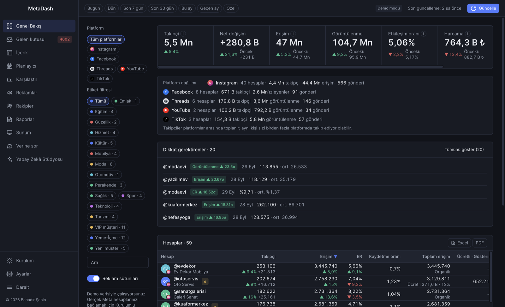

<table>
  <tr>
    <td width="50%">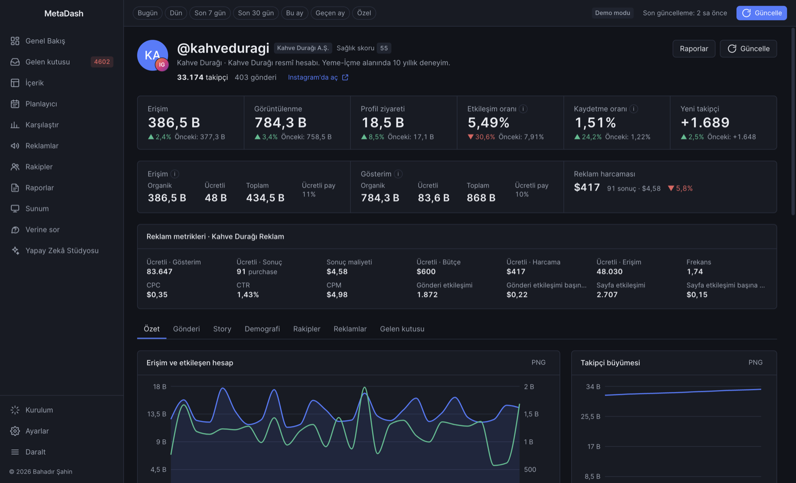<br><sub>Hesap ayrıntısı (Instagram)</sub></td>
    <td width="50%">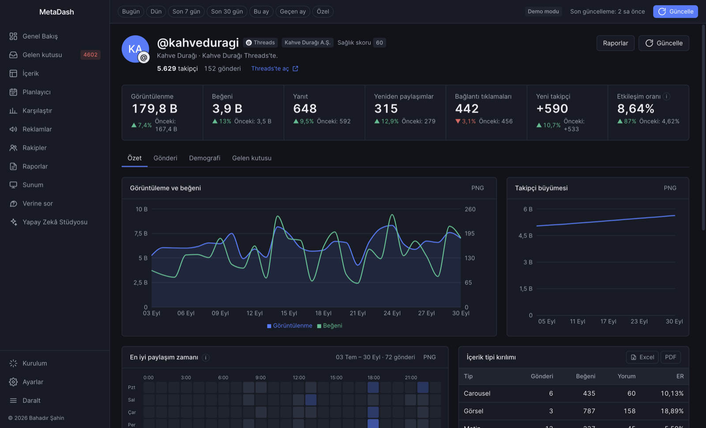<br><sub>Hesap ayrıntısı (Threads): ana metrik görüntülemeler</sub></td>
  </tr>
  <tr>
    <td width="50%">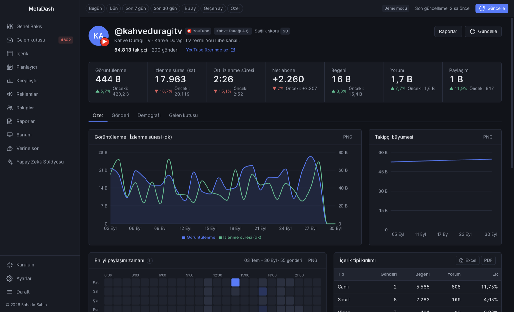<br><sub>Hesap ayrıntısı (YouTube): izlenme süresi, Shorts ve videolar</sub></td>
    <td width="50%">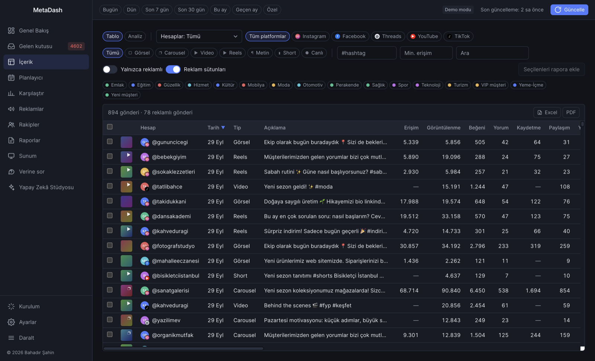<br><sub>İçerik: tüm gönderiler, filtreler ve reklam metrikleri</sub></td>
  </tr>
  <tr>
    <td width="50%">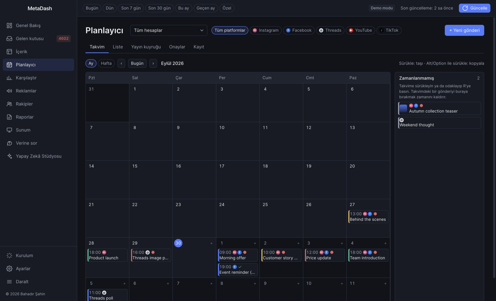<br><sub>Planlayıcı: sürükle-bırak aylık takvim</sub></td>
    <td width="50%">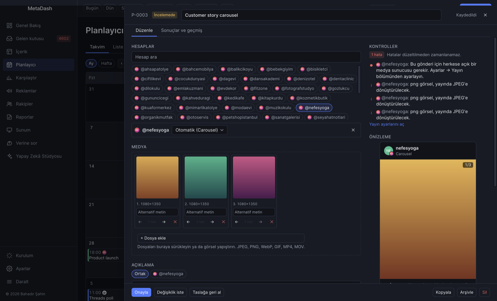<br><sub>Düzenleyici: birden çok hesap, platform bazlı kontroller ve önizlemeler</sub></td>
  </tr>
  <tr>
    <td width="50%">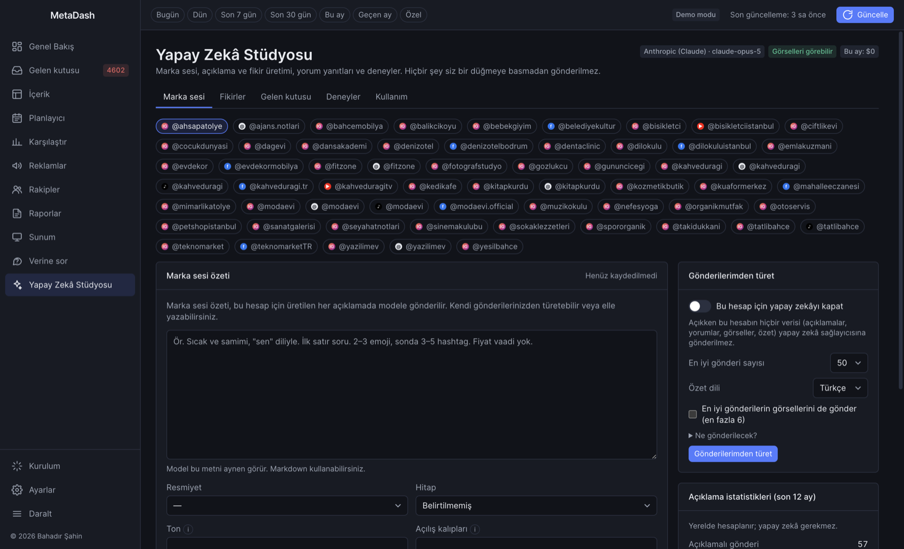<br><sub>Yapay Zekâ Stüdyosu: marka sesi, fikirler, deneyler</sub></td>
    <td width="50%">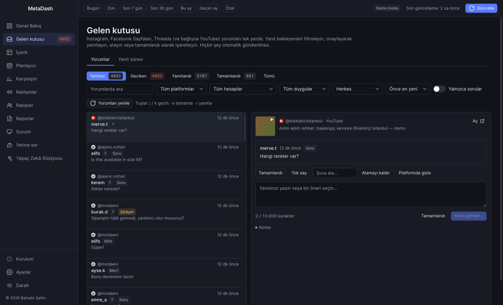<br><sub>Birleşik gelen kutusu: tüm platformların yorumları</sub></td>
  </tr>
  <tr>
    <td width="50%">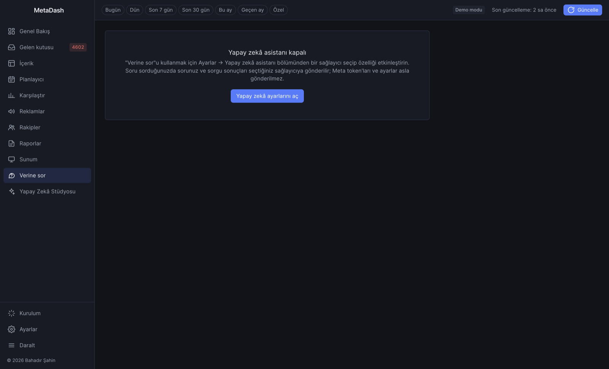<br><sub>Verine sor: düz dille sorular, salt okunur SQL ile yanıtlar</sub></td>
    <td width="50%">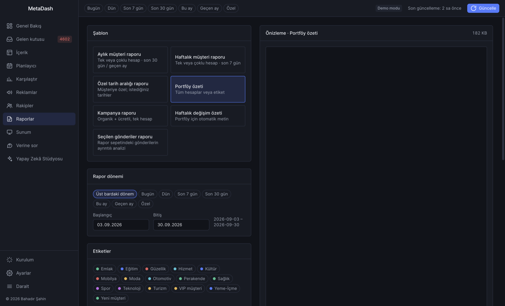<br><sub>Raporlar: canlı önizleme, HTML/PDF/Excel dışa aktarım</sub></td>
  </tr>
  <tr>
    <td width="50%">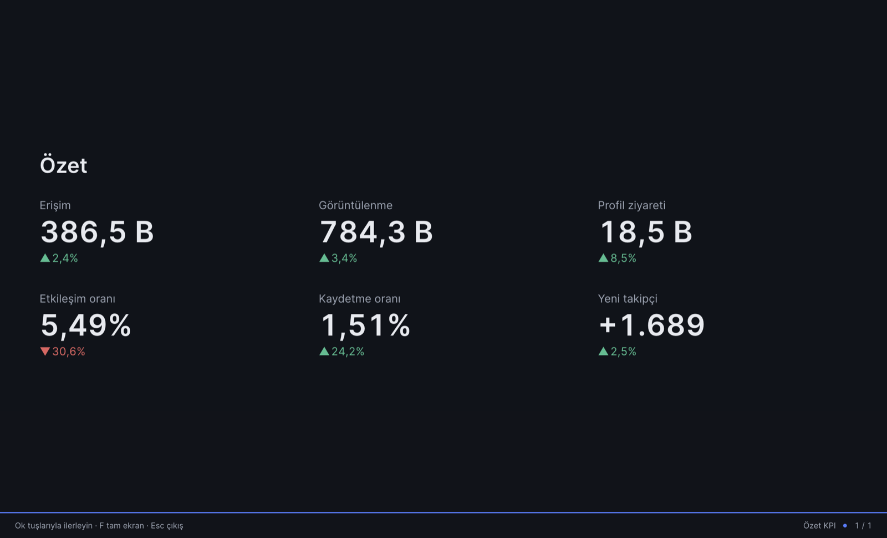<br><sub>Sunum modu</sub></td>
    <td width="50%">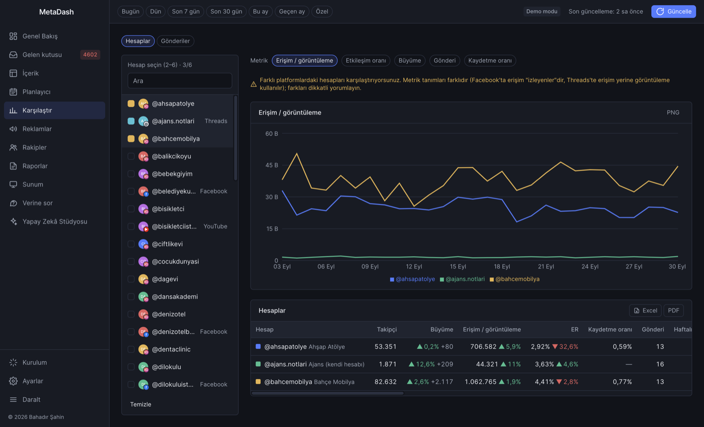<br><sub>Hesap karşılaştırma</sub></td>
  </tr>
  <tr>
    <td width="50%">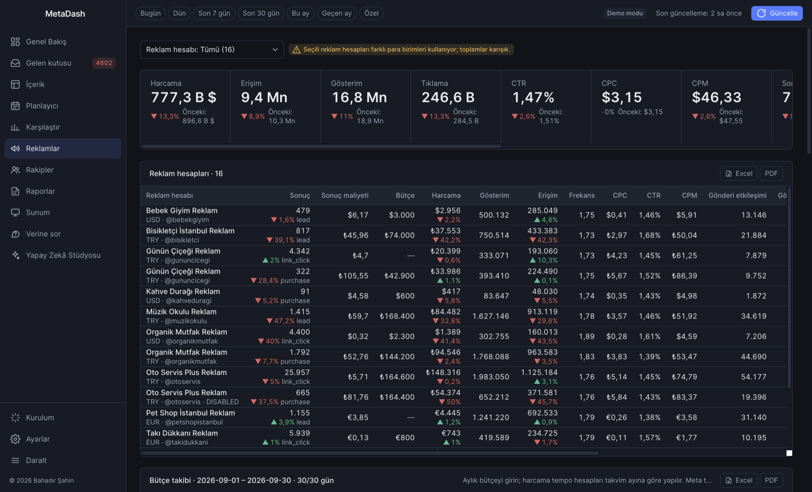<br><sub>Reklamlar: reklam hesapları ve bütçe takibi</sub></td>
    <td width="50%">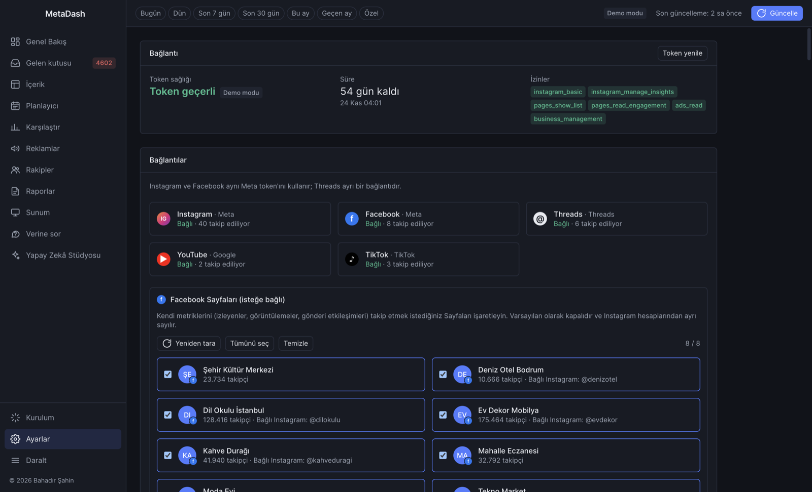<br><sub>Ayarlar: tüm platformların bağlantıları</sub></td>
  </tr>
  <tr>
    <td width="50%">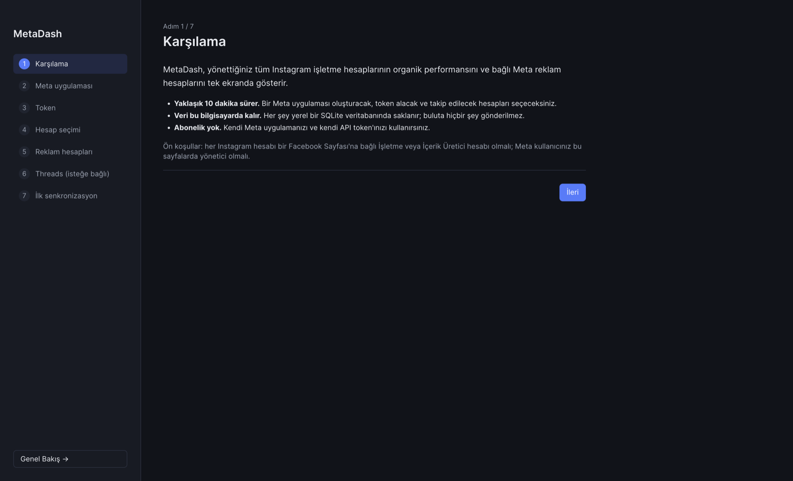<br><sub>Kurulum sihirbazı</sub></td>
    <td width="50%"></td>
  </tr>
</table>

## Özellikler

### Analitik ve raporlar

| Alan | Neler sunar |
| --- | --- |
| **Genel Bakış** | Takip edilen tüm hesapların portföy tablosu: takipçiler ve net değişim, erişim (Threads, YouTube ve TikTok'ta görüntülemeler), etkileşim oranı, kaydetme oranı, gönderiler, sağlık puanı, organik ve ücretli erişim, reklam harcaması. Arama, etiketler, lider tablosu, platform filtresi (Tümü / Instagram / Facebook / Threads / YouTube / TikTok) ve olağandışı değişiklikler için "Dikkat gerektirenler" paneli. |
| **Hesap ayrıntısı** | Önceki döneme göre KPI'lar ve her platforma özel grafikler, sağlık puanı dökümü, ızgara veya tablo olarak gönderiler, hikâyeler, demografi, en iyi paylaşım zamanı ısı haritası, gönderi yaşam döngüsü eğrileri, bağlı reklam metrikleri, organik + ücretli görünüm ve hesabın gelen kutusu. YouTube'da ayrıca izlenme süresi ve Shorts/video/canlı yayın dağılımı. |
| **İçerik** | Tüm hesapların gönderileri tek tabloda, filtreler ve reklam kolonlarıyla; içerik analizi (tür dağılımı, hashtag performansı, en iyi gönderiler); rapor sepeti; her gönderi için yaşam döngüsü, reklam satırları, notlar ve **Dönüştür** içeren bir yan panel. |
| **Karşılaştırma** | Hesaplar yan yana ve gönderiye karşı gönderi. Platformlar karıştığında uyarır. |
| **Reklamlar ve bütçeler** | Tutarlı tek bir metrik setiyle reklam hesapları; kampanya / reklam seti / reklam seviyeleri; yaş, cinsiyet ve platform kırılımları; tanıttıkları gönderilere bağlanan reklamlar. Aylık bütçeler, harcama temposu, ay sonu tahmini, öne çıkarma adayları ve kampanya → reklam seti → reklam dağıtım ağacı. |
| **Rakipler** | Business Discovery ile herkese açık Instagram rakipleri: takipçiler, büyüme, paylaşım sıklığı, ortalama beğeni ve yorum. |
| **Raporlar** | Aylık, haftalık ve özel tarih aralıklı müşteri raporları, portföy özeti, kampanya raporu, haftalık değişim özeti ve seçili gönderiler raporu; ayrıca "Topluluk yanıtı" bölümü. Bölümleri seçin, logo ve yorum ekleyin, rapor dilini belirleyin. Tek dosyalık HTML, PDF veya çok sayfalı Excel olarak dışa aktarın. Kendi markanızla raporlar (ajans adı, logo, vurgu rengi, alt bilgi) ve müşteri bazlı logolar. |
| **Sunum** | Verilerinizden üretilen tam ekran slayt destesi; slaytları seçip sıralamak için bir oluşturucuyla. |
| **Dışa aktarım** | Her tablo `.xlsx` veya PDF'e, her grafik PNG'ye; CSV hazır ayarları ve salt okunur SQL konsolu. |
| **Bildirimler** | Olağandışı değişiklikler, %90'a ulaşan reklam bütçeleri, sessiz hesaplar, süresi dolmak üzere olan token'lar, yayımlama sonuçları, geciken yorumlar ve @bahsetmeler. Her tür ayrı ayrı kapatılabilir. |

### Planlayıcı ve yayımlama

| Alan | Neler sunar |
| --- | --- |
| **Takvim** | Sürükle-bırak aylık ve haftalık görünümler (Alt/Option ile sürüklemek kopyalar), klavye alternatifleri, zamanlanmamış taslaklar, toplu işlemli liste, yayın kuyruğu ve denetim günlüğü. |
| **Düzenleyici** | Birden çok Instagram, Facebook Sayfası ve Threads hesabı için tek gönderi; hesap başına açıklama ve ilk yorum, canlı karakter, hashtag ve bahsetme sayaçları, yerel medya kütüphanesi, her platformun sınırlarına göre doğrulama, en iyi zaman önerileri ve yaklaşık önizlemeler. |
| **İş akışı ve onay** | Taslak → İncelemede → Onaylandı → Zamanlandı → Yayımlandı. Zamanlamadan önce onayı zorunlu kılabilirsiniz. **Müşteri onay paketleri** tek dosyalık HTML/PDF'lerdir: müşteri çevrimdışı olarak onaylar veya değişiklik ister ve size bir yanıt kodu gönderir. |
| **Yayımlama** | MetaDash çalıştığı sürece resmî API'ler üzerinden yayımlar; tepsiden veya menü çubuğundan ve oturum açılışında başlatmayla da. Facebook gönderileri Facebook'un kendisinde de zamanlanabilir. Yeniden denemeler, günlük kota kontrolleri, kaçırılan gönderi yönetimi ve duraklatma düğmesi yerleşiktir. Instagram görselleri ve Threads medyası herkese açık bir medya barındırıcısı (kendi S3 uyumlu depolama alanınız) gerektirir. |
| **Kendi sunucunuzda worker** | Bir VPS, NAS veya Raspberry Pi üzerinde, bilgisayarınız kapalıyken kuyruktaki gönderileri yayımlayan isteğe bağlı Docker servisi. Bkz. [docs/tr/worker.md](docs/tr/worker.md). |

Rehberler: [Planlayıcı](docs/tr/planner.md) · [Yayımlama kurulumu](docs/tr/publishing-setup.md)

### Yapay zekâ (isteğe bağlı, kendi anahtarınızla)

Yapay zekâ özellikleri **varsayılan olarak kapalıdır** ve beta olarak işaretlidir. **Ayarlar → Yapay zekâ asistanı** bölümünden açın ve **Anthropic (Claude)**, **OpenAI**, **Google Gemini** ya da yerel bir **Ollama** modeli seçin. Anahtarlar şifreli saklanır ve kaydedildikten sonra bir daha gösterilmez. Her hesap yapay zekâdan tamamen çıkarılabilir.

| Özellik | Ne yapar |
| --- | --- |
| **Verine sor** | "Son 30 günde en hızlı büyüyen 5 hesap hangisi?" gibi soruları düz dille sorun. Asistan yerel veritabanınızda salt okunur SQL çalıştırarak yanıtlar ve **Bunu nasıl buldum** altında her sorguyu gösterir. |
| **Yapay zekâ ile yaz / Açıkla** | Raporun kendi rakamlarından rapor yorumu taslağı hazırlar ve Genel Bakış'taki bir anomaliyi açıklar. |
| **Stüdyo: Marka sesi** | Hesap başına marka sesi özeti; yerelde hesaplanan açıklama istatistikleri (yapay zekâ gerekmez) ve isteğe bağlı olarak yapay zekâ ile türetilen bir öneri. |
| **Stüdyo: Açıklamalar ve hashtag'ler** | Düzenleyicide açıklama varyantları (isteğe bağlı olarak görselleri de kullanarak) ve kendi gönderilerinizin performans artışına dayalı hashtag önerileri. |
| **Stüdyo: Fikirler ve dönüştürme** | Özel günleri de içeren ve en iyi saatlerinizde Planlayıcı taslaklarına dönüşen aylık içerik fikirleri. Bir gönderiyi karusele, Threads gönderisine, Facebook gönderisine veya hikâye karelerine dönüştürün. |
| **Stüdyo: Yanıtlar ve deneyler** | Gelen kutusunda yanıt önerileri (yorum yazanlar anonimleştirilir, her yanıt onaylanır), isteğe bağlı duygu etiketleri ve güven aralıklı A/B açıklama deneyleri. |
| **Kullanım** | Özellik başına token sayıları ve tahmini maliyet. Her yapay zekâ işleminde "Ne gönderilecek?" önizlemesi vardır. |

Rehber: [Yapay Zekâ Stüdyosu](docs/tr/ai-studio.md)

### Birleşik gelen kutusu

Instagram, Facebook Sayfaları, Threads ve YouTube yorumları tek listede. Duruma, platforma, hesaba, duyguya ve atanan kişiye göre filtreleyebilir, klavye kısayollarını kullanabilirsiniz. Yanıtlar her zaman onayınızı gerektirir; platformun izin verdiği yerlerde yorumları gizleyebilirsiniz. Gelen kutusu ilk yanıt süresini, yanıtlanma yüzdesini ve hedef süre içinde yanıtlanma yüzdesini (sağlık puanının yanıt bileşeni) izler, yeni yorumları arka planda denetler ve müşteri raporlarına "Topluluk yanıtı" bölümü ekler. Doğrudan mesajlar dahil değildir. Rehber: [docs/tr/inbox.md](docs/tr/inbox.md)

### Ekip ve müşteri görünümü

Bir kurulum **yayıncıdır**: token'ları tutar, senkronize eder ve ekibinizin zaten eşitlediği bir klasöre sırlardan arındırılmış, isteğe bağlı olarak şifreli bir anlık görüntü yazar. Ekip arkadaşları **abone olur** ve salt okunur bir kopya alır. Notlar, @bahsetmeler ve gelen kutusu durumu üye başına olay günlükleriyle taşınır. **Analist** rolü ayarları sınırlar; **Müşteriye sun** yalnızca seçilen müşterilerin hesaplarını bir PIN arkasında gösterir. Roller bir güvenlik sınırı değil, korkuluktur. Rehber: [docs/tr/team.md](docs/tr/team.md)

### Komut satırı ve otomasyon

Uygulama dosyası `--cli` ile penceresiz çalışır: `sync`, `report`, `export`, `backup`, `accounts`, `status`, `inbox`, `worker` ve `team`. Örneğin her ayın 1'inde geçen ayın PDF raporlarını yazmak için cron, launchd veya Görev Zamanlayıcı'da kullanabilirsiniz. **Ayarlar → Komut satırı aracı** bir `metadash` komutu kurar. Rehber: [docs/tr/cli.md](docs/tr/cli.md)

### Diller

Arayüz varsayılan olarak **İngilizce**dir. **Türkçe** eksiksizdir. **Deutsch** ve **Español** kısmidir: dil seçicide listelenirler ve henüz çevrilmemiş her metin İngilizce görünür. **Ayarlar → Tema · Dil** bölümünden değiştirebilirsiniz. Raporların kendi dil ayarı vardır. Çeviriler düz JSON dosyalarıdır; katkı vermek için [docs/tr/translating.md](docs/tr/translating.md) sayfasına bakın.

## Uygulamayı indirme ve kurma

En son kurulum dosyasını **[GitHub Releases](https://github.com/mbahadirs/metadash/releases)** sayfasından indirin.

| Platform | Dosya |
| --- | --- |
| macOS, Apple Silicon | `MetaDash-<sürüm>-mac-arm64.dmg` |
| macOS, Intel | `MetaDash-<sürüm>-mac-x64.dmg` |
| Windows x64 | `MetaDash-Setup-<sürüm>.exe` (kurulum programı; klasörü seçebilirsiniz) |
| Linux x64 | `MetaDash-<sürüm>-linux-x86_64.AppImage` veya `MetaDash-<sürüm>-linux-amd64.deb` |

İsteğe bağlı yayın worker'ı bir Docker imajıdır (`ghcr.io/mbahadirs/metadash-worker`, amd64 ve arm64). Bkz. [docs/tr/worker.md](docs/tr/worker.md).

### Kod imzasız paketler

Sürüm paketleri yalnızca depoda imzalama sırları tanımlıysa kod imzalı olur; bu yüzden işletim sisteminiz MetaDash'i ilk açtığınızda uyarı verebilir.

- **macOS** ("MetaDash doğrulanamadı" veya "hasarlı"): uygulamayı Uygulamalar klasörüne taşıyın, ardından ya şunu çalıştırın

  ```bash
  xattr -cr /Applications/MetaDash.app
  ```

  ya da uygulamayı bir kez açmayı deneyip **Sistem Ayarları → Gizlilik ve Güvenlik** bölümünde **Yine de Aç**'a tıklayın. macOS'ta ve `.deb` paketinde MetaDash güncellemeleri kendisi kurmaz: yeni sürümü bildirir ve sürüm sayfasına bağlantı verir. Windows ve AppImage uygulama içinden güncellenir.
- **Windows** (SmartScreen "Windows bilgisayarınızı korudu"): **Ek bilgi → Yine de çalıştır**'a tıklayın.
- **Linux:** AppImage'ı çalıştırılabilir yapın (`chmod +x MetaDash-*.AppImage`) ve çalıştırın ya da Debian paketini `sudo apt install ./MetaDash-*.deb` ile kurun.

## Hızlı başlangıç

1. **Önce demo verisiyle deneyin.** Kurulum sihirbazının karşılama adımında **Demo verisiyle keşfet**'i seçin. Bu, 40 Instagram hesabı, 8 Facebook Sayfası, 6 Threads profili, 2 YouTube kanalı ve 3 TikTok hesabı yükler. Hepsi kurgusaldır ve geliştirici uygulaması gerekmez. Daha sonra gerçek hesaplara geçmek için **Ayarlar → Tüm verileri sil**'i kullanıp kurulumu yeniden çalıştırın.
2. **Meta'yı bağlayın (Instagram, Facebook Sayfaları, reklamlar).** Development modunda bir Meta uygulaması oluşturun ([rehber](docs/tr/meta-app-setup.md)), ardından kurulum sihirbazının 7 adımını izleyin:
   1. **Karşılama**
   2. **Meta uygulaması**: App ID ve App Secret'ı yapıştırın.
   3. **Token**: Graph API Explorer'dan aldığınız kullanıcı token'ını yapıştırın. MetaDash bunu 60 günlük bir token'a çevirir ve verilen izinleri gösterir.
   4. **Hesaplar**: Instagram hesaplarını ve isteğe bağlı olarak Facebook Sayfalarını seçin; müşteri adlarını ve etiketleri girin.
   5. **Reklam hesapları**: isteğe bağlı olarak her reklam hesabını bir hesapla eşleyin.
   6. **Threads** (isteğe bağlı): Threads uygulamanızla bağlanın ([rehber](docs/tr/threads-setup.md)).
   7. **İlk senkronizasyon**
3. **Diğer platformları** **Ayarlar → Bağlantılar** bölümünden ekleyin:
   - **YouTube**: kendi Google OAuth "Masaüstü uygulaması" istemciniz ([rehber](docs/tr/youtube-setup.md)).
   - **TikTok** (deneysel): kendi TikTok geliştirici uygulamanız, sandbox veya onaylı ([rehber](docs/tr/tiktok-setup.md)).
4. Verileri üst çubuktaki **Güncelle** ile tazeleyin ya da Ayarlar'da günlük otomatik senkronizasyonu açın.
5. **İsteğe bağlı eklentiler:** yayımlama ([kurulum](docs/tr/publishing-setup.md)), yapay zekâ (**Ayarlar → Yapay zekâ asistanı**), ekip çalışma alanı ([rehber](docs/tr/team.md)), komut satırı ([rehber](docs/tr/cli.md)) ve worker ([rehber](docs/tr/worker.md)).

Meta izinleri: `instagram_basic`, `instagram_manage_insights`, `pages_show_list`, `pages_read_engagement` ve `ads_read` zorunludur. `business_management`, `instagram_manage_comments` ve `read_insights` (Facebook Sayfaları için) isteğe bağlıdır. Yayımlama ve gelen kutusu özellikleri ek izinler gerektirir; rehberlerde listelenmiştir.

## Veri ve gizlilik

**Her şey bilgisayarınızda saklanır**; kullanıcı veri klasöründeki tek bir SQLite veritabanında (`data.db`, WAL modu):

| İşletim sistemi | Konum |
| --- | --- |
| macOS | `~/Library/Application Support/MetaDash/` |
| Windows | `%APPDATA%\MetaDash\` |
| Linux | `$XDG_CONFIG_HOME/MetaDash/` (genellikle `~/.config/MetaDash/`) |

**Bilgisayardan ne çıkar?** Telemetri, analitik veya MetaDash sunucusu yoktur. Main process yalnızca şu servislere bağlanır:

| Hedef | Ne zaman | Ne |
| --- | --- | --- |
| Platform API'leri: `graph.facebook.com` (Instagram, Facebook, reklamlar), `graph.threads.net`, Google (`oauth2.googleapis.com`, `www.googleapis.com`, `youtubeanalytics.googleapis.com`), `open.tiktokapis.com` | Senkronizasyon, hesap bağlama, yayımlama, gelen kutusu yanıtları | Bağladığınız hesaplar için token'larınız ve API istekleri |
| Medya barındırıcınız (S3 uyumlu depolama alanı veya bir Facebook Sayfası) | Yalnızca Instagram görselleri veya Threads medyası yayımladığınızda | O gönderinin medya dosyası |
| GitHub (`api.github.com`, `github.com`) | Yalnızca kurulu sürümlerde: açılıştan sonra ve 6 saatte bir | Güncelleme denetimi. Sizinle ilgili hiçbir bilgi gönderilmez. **Ayarlar → Hakkında** bölümünden kapatabilirsiniz. |
| Yapay zekâ sağlayıcınız (`api.anthropic.com`, `api.openai.com`, `generativelanguage.googleapis.com`) veya yerel Ollama'nız | Yalnızca yapay zekâ açıksa **ve** bir yapay zekâ özelliğini kullandığınızda | O özelliğin "Ne gönderilecek?" önizlemesinde gösterilen veriler, kendi anahtarınızla. Ollama her şeyi yerelde tutar. |
| Kendi sunucunuzdaki worker | Yalnızca bir worker bağlarsanız | "Yayınlayan: Worker" olarak ayarladığınız gönderiler, medyaları ve hesap başına bir yayımlama token'ı |
| Paylaşılan ekip klasörünüz | Yalnızca bir ekip oluşturur veya bir ekibe katılırsanız | Hiçbir sır içermeyen (isteğe bağlı olarak şifreli) bir anlık görüntü ile notlar ve gelen kutusu olayları. Dosyaları kendi eşitleme istemciniz (Dropbox, iCloud, …) taşır. |

Profil fotoğrafları ve küçük resimler platformların CDN adreslerinden yüklenir. "Instagram'da aç" gibi bağlantılar tarayıcınızda açılır.

**Sırlar diskte şifreli saklanır.** Token'lar, uygulama sırları, yapay zekâ anahtarları ve S3 anahtarları, makine kimliğinden türetilen bir anahtarla AES-256-GCM kullanılarak şifrelenir; kopyalanan bir veritabanı başka bir bilgisayarda bunları çözemez. Yeni bir makineye geçmek için **Ayarlar → Veri taşıma**'yı bir parolayla kullanın. Ayrıntılar: [Mimari → Güvenlik modeli](docs/tr/architecture.md#güvenlik-modeli), [SECURITY.md](SECURITY.md).

## Belgeler

Tam dizin [docs/tr/README.md](docs/tr/README.md) dosyasındadır. İngilizce sürümler [docs/](docs/README.md) klasöründedir.

| Konu | Rehber |
| --- | --- |
| Meta uygulaması (Instagram, Facebook Sayfaları, reklamlar) | [meta-app-setup.md](docs/tr/meta-app-setup.md) |
| Threads | [threads-setup.md](docs/tr/threads-setup.md) |
| YouTube | [youtube-setup.md](docs/tr/youtube-setup.md) |
| TikTok (deneysel) | [tiktok-setup.md](docs/tr/tiktok-setup.md) |
| Planlayıcı | [planner.md](docs/tr/planner.md) |
| Yayımlama ve medya barındırıcıları | [publishing-setup.md](docs/tr/publishing-setup.md) |
| Yapay Zekâ Stüdyosu | [ai-studio.md](docs/tr/ai-studio.md) |
| Birleşik gelen kutusu | [inbox.md](docs/tr/inbox.md) |
| Ekip çalışma alanı ve roller | [team.md](docs/tr/team.md) |
| Komut satırı aracı | [cli.md](docs/tr/cli.md) |
| Kendi sunucunuzda yayın worker'ı | [worker.md](docs/tr/worker.md) |
| Bilinen sınırlamalar | [known-limitations.md](docs/tr/known-limitations.md) |
| Mimari | [architecture.md](docs/tr/architecture.md) |
| Platform ekleme (sağlayıcılar) | [providers.md](docs/tr/providers.md) |
| Çeviri | [translating.md](docs/tr/translating.md) |

## Geliştirme

### Gereksinimler

- Node.js 20 veya üstü, npm (isteğe bağlı worker Docker olmadan çalıştırılırsa Node.js 22 gerekir)
- `better-sqlite3`'ün Electron sürümünüz için derlenmesi gerekirse bir C/C++ derleme ortamı: macOS'ta Xcode Command Line Tools, Windows'ta Visual Studio Build Tools, Linux'ta `build-essential` ve `python3`

### Kurulum

```bash
git clone https://github.com/mbahadirs/metadash.git
cd metadash
npm install        # postinstall, better-sqlite3'ü Electron için yeniden derler
npm run seed       # isteğe bağlı: demo verisi, geliştirici uygulaması gerekmez
npm run dev        # Vite geliştirme sunucusu + anında yenilemeli Electron
```

### Betikler

| Betik | Ne yapar |
| --- | --- |
| `npm run dev` | Vite geliştirme sunucusu + anında yenilemeli Electron |
| `npm start` | Renderer'ı bir kez derler ve Electron'u geliştirme sunucusu olmadan başlatır |
| `npm run seed` / `npm run seed:reset` | Demo verisi yazar (zaten varsa atlar) / silip yeniden üretir |
| `npm test` | Vitest; yerel `better-sqlite3` derlemesi eşleşsin diye Electron'un Node'u altında çalışır |
| `npm run typecheck` | Renderer'ın TypeScript denetimi |
| `npm run i18n:check` | Eksik veya fazla çeviri anahtarları, yer tutucu uyuşmazlıkları, kodda kullanılan bilinmeyen anahtarlar |
| `npm run smoke` | Renderer'ı derler ve gerçek bir Electron penceresinde her ekranı gezer (önce demo verisi yükleyin) |
| `npm run cli -- <komut>` | Penceresiz komut satırını kaynak koddan çalıştırır, ör. `npm run cli -- status` |
| `node scripts/cli-smoke.mjs` | Geçici bir demo veritabanında, gerçek bir PDF dahil uçtan uca komut satırı duman testi |
| `npm run rebuild` | `better-sqlite3`'ü Electron için yeniden derler (`NODE_MODULE_VERSION` hatalarını giderir) |
| `npm run build:mac` / `build:win` / `build:linux` / `build` | Kurulum paketleri (aşağıya bakın) |

### Demo verisi

Arayüz üzerinde çalışmak için hiçbir geliştirici uygulamasına ihtiyacınız yoktur. Demo veri seti deterministiktir: 120 güne yayılan 40 Instagram hesabı, 8 Facebook Sayfası, 6 Threads profili, 2 YouTube kanalı ve 3 TikTok hesabı; gönderiler, hikâyeler, yorumlar ve gelen kutusu konuşmaları, demografi, 16 reklam hesabı, rakipler ve planlayıcı içeriğiyle. Diğer yükleme yolları:

- Kurulum sihirbazında **Demo verisiyle keşfet**'e ya da Ayarlar'da **Demo verisi yükle**'ye tıklayın.
- Electron'u `--demo` ile başlatın; ör. bir terminalde `npx vite`, diğerinde `npm run dev:electron -- --demo`.

Demo verisiyle **Güncelle** hiçbir API'yi çağırmaz: senkronizasyonu taklit eder ve veri setini bir gün ilerletir. Yayımlama ve gelen kutusu yanıtları da taklit edilir.

### Ortam değişkenleri

| Değişken | Amaç |
| --- | --- |
| `METADASH_USER_DATA` | Kullanıcı veri klasörünü (`data.db`'nin bulunduğu yer) değiştirir. `npm run seed` de dikkate alır. |
| `VITE_DEV_SERVER_URL` | Renderer'ı `dist/renderer` yerine bir geliştirme sunucusundan yükler (`npm run dev` ayarlar). |
| `METADASH_GRAPH_DELAY_MS` | Kuyruğa alınan Graph API istekleri arasındaki temel gecikme, ms (varsayılan `250`). |
| `METADASH_SMOKE` | `1` duman testini çalıştırır: her ekranı gezer, ekran görüntüsü kaydeder, renderer hatalarında sıfırdan farklı kodla çıkar. |
| `METADASH_SMOKE_DIR` / `_ROUTES` / `_THEME` / `_SYNC` | Ekran görüntüsü klasörü, virgülle ayrılmış rotalar, `light`/`dark` ve ayrıca senkronizasyon çalıştırmak için `1`. |

### Kurulum paketleri oluşturma

```bash
npm run build:mac     # dmg + zip, arm64 ve x64
npm run build:win     # NSIS kurulum programı, x64
npm run build:linux   # AppImage + deb, x64
npm run build         # hepsi
```

Çıktılar `release/` klasörüne yazılır. Her derleme betiği ardından `better-sqlite3`'ü Electron için yeniden derler; böylece `npm run dev` çalışmaya devam eder. Her platformu kendi işletim sisteminde derleyin; yerel modüller çapraz derlemeyi güvenilmez kılar.

İsteğe bağlı kod imzalama: electron-builder, macOS anahtar zincirindeki "Developer ID Application" sertifikasını ya da `CSC_LINK` / `CSC_KEY_PASSWORD` değerlerini kullanır. Noter onaylı bir macOS paketi için `APPLE_ID`, `APPLE_APP_SPECIFIC_PASSWORD` ve `APPLE_TEAM_ID` değerlerini ayarlayıp `npm run build:mac:notarized` çalıştırın.

Worker imajı: depo kökünden `docker build -f worker/Dockerfile -t metadash-worker .`. Duman testi: `sh worker/test/smoke.sh`.

### Sürüm yayınlama

Sürümleri GitHub Actions derler ([`.github/workflows/release.yml`](.github/workflows/release.yml)).

1. [CHANGELOG.md](CHANGELOG.md) dosyasını güncelleyip commit edin.
2. Sürümü artırın: `npm version patch` (veya `minor` / `major`). Bu komut `package.json`'ı günceller, commit eder ve bir `vX.Y.Z` etiketi oluşturur.
3. Commit'i ve etiketi gönderin: `git push --follow-tags`.
4. Sürüm iş akışı etiketin `package.json` ile eşleştiğini denetler, testleri çalıştırır, macOS, Windows ve Linux'ta derler ve kurulum dosyalarıyla bir GitHub Release yayınlar. Aynı etiket, çok mimarili worker imajını GHCR'a gönderen [`worker-image.yml`](.github/workflows/worker-image.yml) iş akışını da tetikler. `worker-vX.Y.Z` etiketi yalnızca worker imajını yayınlar.

Depoda imzalama sırları varsa (`CSC_LINK`, `CSC_KEY_PASSWORD`; noter onayı için ayrıca `APPLE_ID`, `APPLE_APP_SPECIFIC_PASSWORD`, `APPLE_TEAM_ID`) paketler imzalanır; yoksa imzasız olur. Var olan bir etiketi yeniden derlemek için sürüm iş akışını elle de başlatabilirsiniz.

## Proje yapısı

```
src/
  main/                    Electron main process (ES modülleri)
    index.js               uygulama yaşam döngüsü, pencere, duman testi, --cli girişi
    preload.cjs            contextBridge: window.api'yi renderer'a açar
    ipc/                   alana göre IPC işleyicileri (+ setup.<platform>.handlers.js)
    providers/             platform başına bir sağlayıcı: instagram, facebook, threads, youtube, tiktok
                           (+ yetenekler, ortak istatistik/metrik yardımcıları, _template)
    meta/                  Meta Graph API istemcisi, hız sınırlayıcı, hatalar, yetkilendirme, reklamlar, rakipler
    oauth/                 PKCE, tek seferlik loopback alıcısı, tarayıcı açıcı (YouTube, TikTok)
    sync/                  orkestratör (p-queue), işler, zamanlayıcı, süreçler arası kilit, demo senkronizasyonu
    db/                    better-sqlite3 bağlantısı, numaralı SQL migration'ları (001–014), sorgu modülleri
    analytics/             sağlık, etkileşim, en iyi zaman, yaşam döngüsü, anomali, bütçe, hashtag'ler, A/B testleri,
                           türetilmiş seriler
    planner/               medya kütüphanesi ve inceleme, doğrulama, en iyi zaman önerileri, onay paketleri
    publishing/            yayın kuyruğu, platform adımları, sınırlar, medya barındırıcıları (S3, Facebook Sayfası, URL)
    inbox/                 yorum adaptörleri, yoklayıcı, yanıtlar, SLA metrikleri, duygu analizi
    ai/                    sağlayıcılar (Anthropic SDK, OpenAI, Gemini, Ollama), Verine sor, Stüdyo, kullanım/fiyat
    team/                  paylaşılan klasör anlık görüntüleri, olay günlükleri, roller, müşteri görünümü, notlar
    worker/                kendi sunucunuzdaki yayın worker'ının istemcisi (eşleştirme, token mühürleme, senkronizasyon)
    cli/                   penceresiz komut satırı aracı
    export/                HTML / PDF / Excel raporları, tablo dışa aktarımları, CSV, veri taşıma, markalama
    locales/               main process metinleri: <dil>/<ad-alanı>.json, index.json (dil listesi)
    config/                ayar deposu, sır şifreleme, makine kimliği
    seed/                  deterministik demo verisi
    tray.js, lifecycle.js  tepsi/menü çubuğu, oturum açılışında başlatma, arka plan modu
  renderer/                React 18 + Vite + TypeScript + Tailwind
    routes/                Overview, Account, Content, Compare, Ads, Competitors, Reports, Presentation,
                           Planner, Studio, Inbox, Ask, Settings, Setup
    platforms/             platform başına arayüz sözlüğü (etiketler, simgeler, KPI kutucukları)
    locales/               arayüz metinleri: <dil>/<ad-alanı>.json, keys.ts (üretilen anahtar tipi)
    components/ charts/ hooks/ store/ lib/ styles/
  shared/publish/          uygulama ile worker'ın paylaştığı saf yayımlama kodu
worker/                    isteğe bağlı, kendi sunucunuzda çalışan yayın worker'ı (Node 22, sıfır bağımlılık, Docker)
scripts/                   seed, i18n denetimi/çıkarımı, komut satırı duman testi, tepsi simgeleri, afterPack (Electron fuses)
tests/                     Vitest test takımları ve API fikstürleri
docs/                      rehberler (Türkçeleri docs/tr/ altında), oauth/callback.html (TikTok kod yapıştırma sayfası)
resources/                 derleme kaynakları (simgeler, macOS entitlements)
electron-builder.yml       paketleme yapılandırması
```

## Mimari

Renderer'ın Node.js erişimi yoktur. Main process ile yalnızca preload betiğinin açtığı `window.api` üzerinden konuşur ve her çağrı `{ ok: true, data }` ya da `{ ok: false, error: { code, message, hint } }` döndürür. Veritabanı, token'lar ve tüm ağ erişimi main process'e aittir. Her platform tek bir arayüzün arkasındaki bir **sağlayıcıdır** (provider); böylece senkronizasyon, analitik, raporlar ve arayüz platform adları yerine yetenekleri okur.

IPC, veritabanı ve migration'lar, sağlayıcılar, senkronizasyon, yayımlama, analitik, dışa aktarımlar, veri taşıma ve güvenlik modeli için **[docs/tr/architecture.md](docs/tr/architecture.md)** dosyasına bakın. Platform eklemek için: [docs/tr/providers.md](docs/tr/providers.md).

## Katkıda bulunma

Katkılarınızı bekliyoruz: hata bildirimleri, çeviriler, belgeler ve kod. Geliştirme akışı, denetimler, commit kuralları ve çeviri akışı için [CONTRIBUTING.md](CONTRIBUTING.md) dosyasına bakın; issue ve pull request'leri Türkçe de açabilirsiniz. Bir güvenlik sorununu bildirmek için [SECURITY.md](SECURITY.md) dosyasındaki adımları izleyin. Sürüm notları [CHANGELOG.md](CHANGELOG.md) dosyasındadır.

## Lisans

[MIT](LICENSE) © 2026 Bahadır Şahin ve katkıda bulunanlar.

MetaDash bağımsız bir projedir; Meta Platforms, Inc., Google LLC veya TikTok Pte. Ltd. ile bağlantılı değildir ve bu şirketler tarafından onaylanmamış ya da desteklenmemiştir. Instagram, Facebook ve Threads, Meta Platforms, Inc.'in; YouTube, Google LLC'nin; TikTok, ByteDance Ltd.'nin ticari markalarıdır.
